# zhenshi4hang16m 五次试验曲线图

说明：本次五个 trial 均为有效记录，曲线均参与统计。

## 置信度曲线

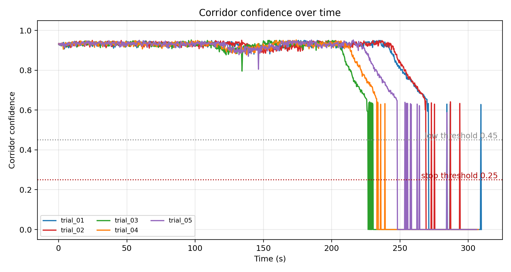

## 安全裕度曲线

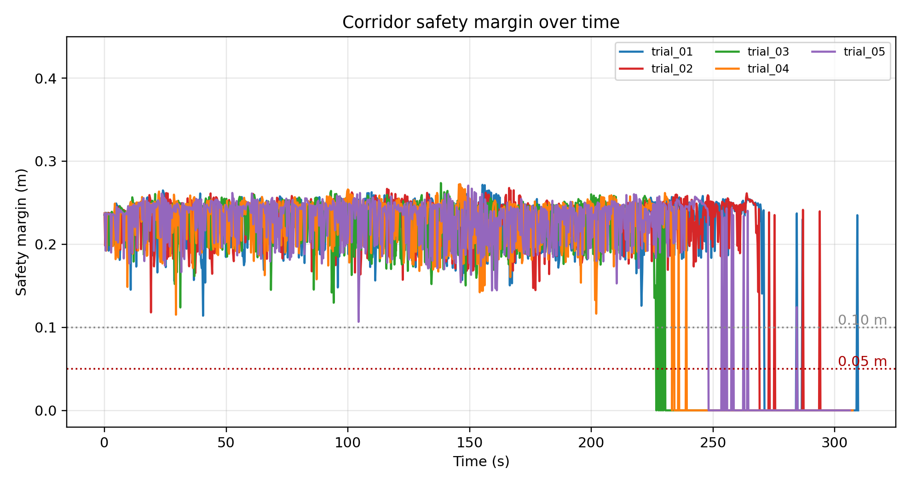

## 走廊宽度曲线

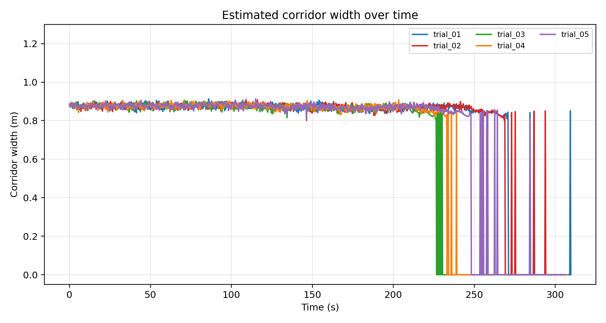

## 线速度指令曲线

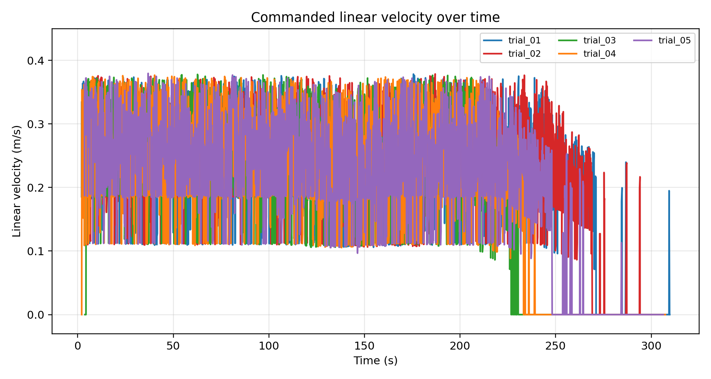

## 角速度绝对值曲线

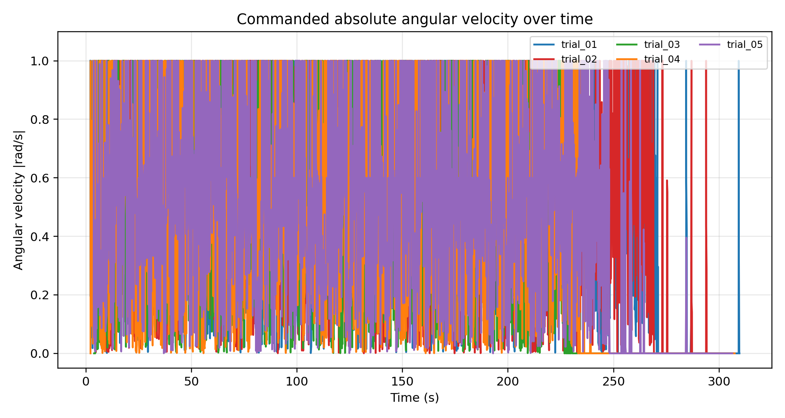

## 投影点数曲线

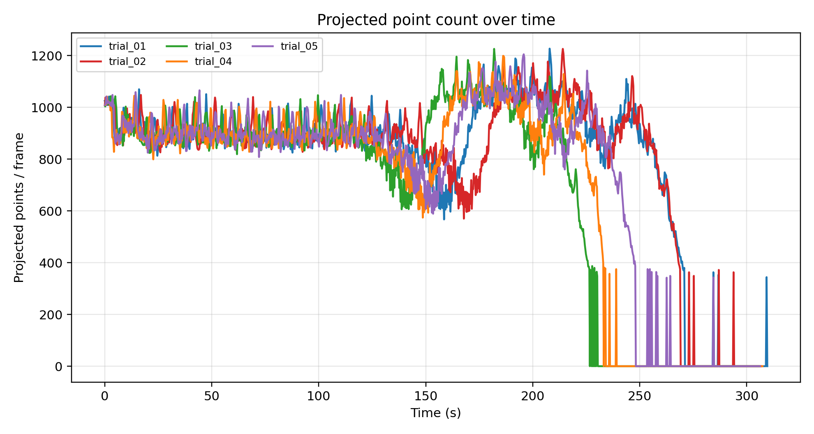

## 左行点数曲线

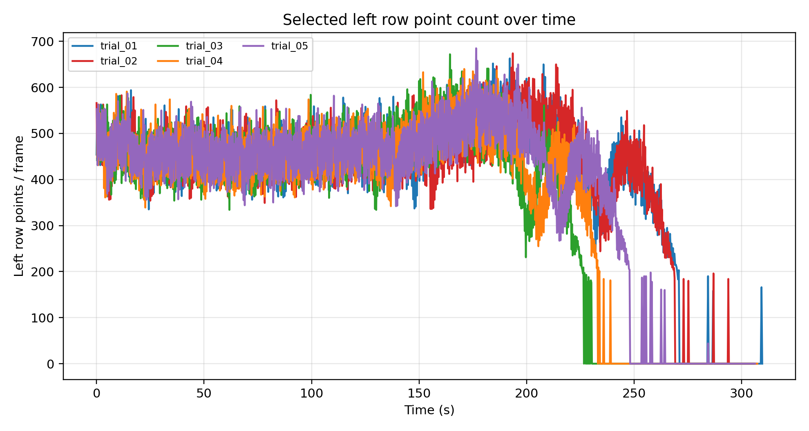

## 右行点数曲线

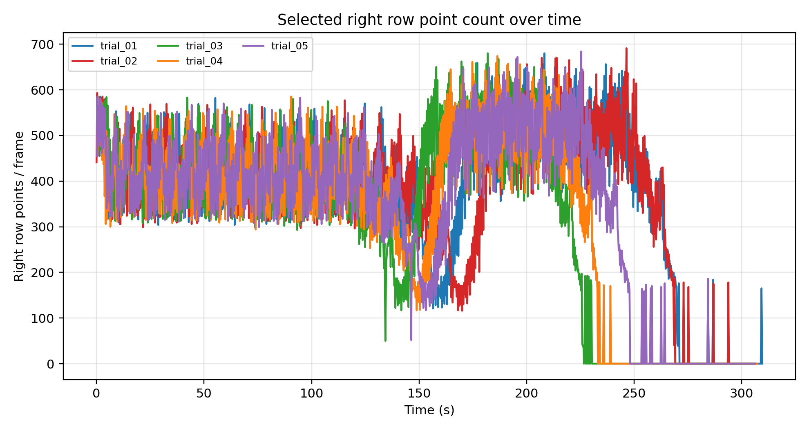

## 中心线可用性曲线

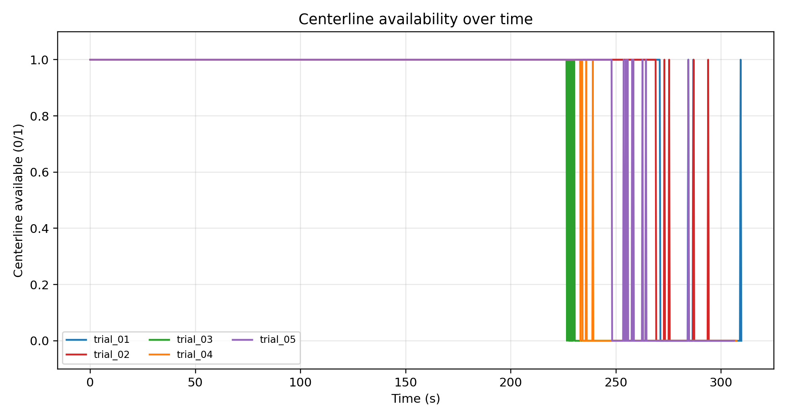

## 航向角曲线

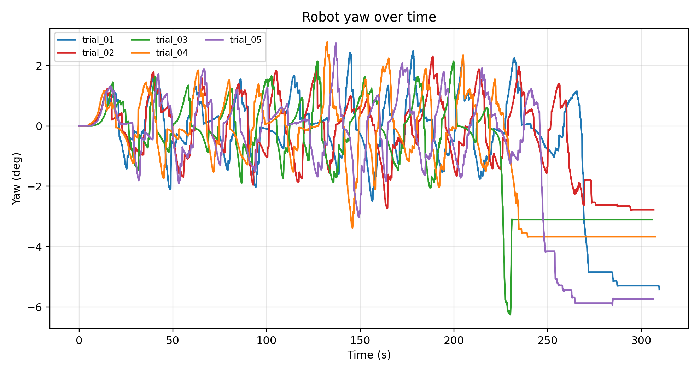

## odom轨迹

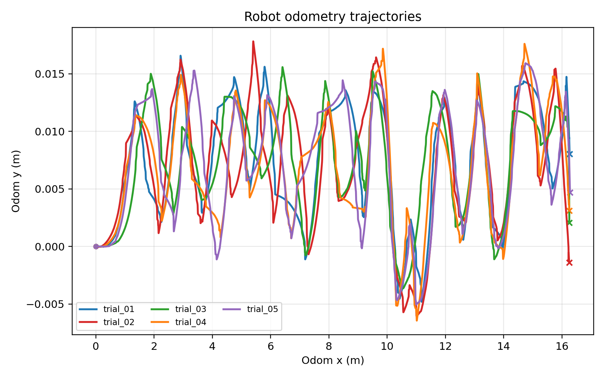

## 有效试验汇总柱状图

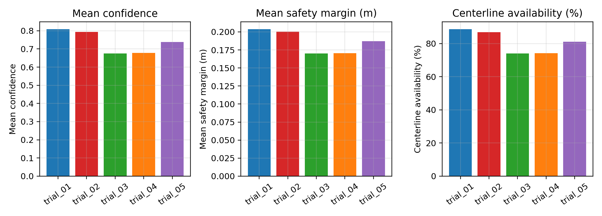

