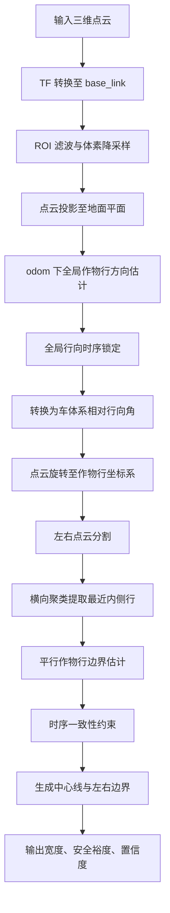
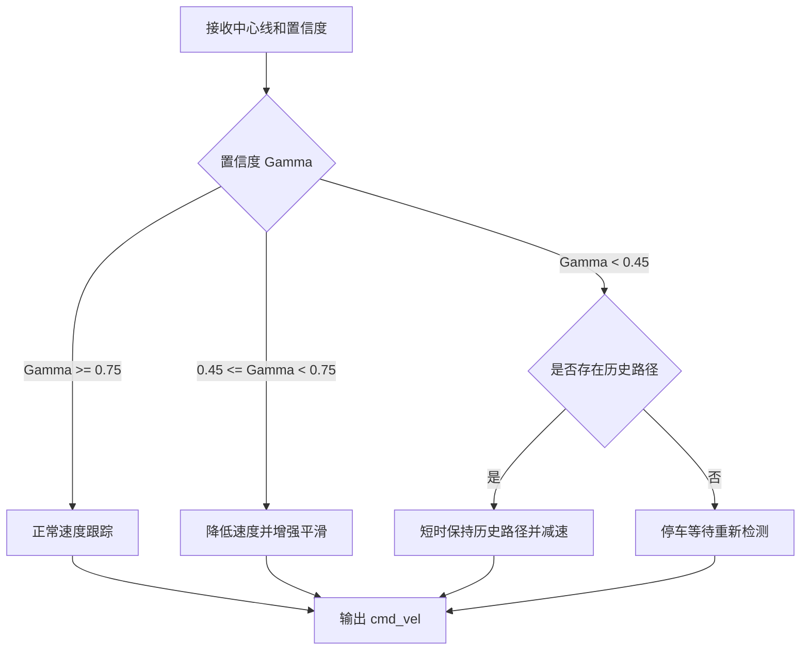

# 面向冠下无人平台导航的全局行向约束内侧作物行走廊检测方法

## 摘要

针对玉米生长后期冠层下无人运动平台在行间导航过程中存在的多行点云干扰、车体偏航导致中心线估计偏斜以及局部遮挡引起路径抖动等问题，提出一种面向冠下导航的全局行向约束内侧作物行走廊检测方法。该方法首先将激光雷达点云统一转换至车体坐标系并进行感兴趣区域滤波与地面投影；随后利用里程计坐标系下作物行方向相对稳定的特点，估计并时序锁定全局作物行方向，实现车体姿态与作物行方向的解耦；在作物行坐标系中对左右两侧点云进行横向聚类，提取距离机器人最近的左右内侧作物行，避免外侧第二、第三行点云对导航边界的干扰；进一步构建平行作物行约束模型，仅估计左右作物行横向位置，并结合时序一致性约束抑制检测跳变；最后生成局部可通行走廊中心线，并输出行间宽度、安全裕度和检测置信度。仿真与实车试验可从车体偏航、多行干扰、点云缺失和冠层遮挡等工况验证所提方法的鲁棒性。预期结果表明，与传统最小二乘直线拟合和单帧 RANSAC 行检测方法相比，所提方法能够降低中心线横向误差和路径抖动，提高冠下行间导航的连续性与安全性。

**关键词**：农业机器人；冠下导航；点云投影；作物行检测；中心线提取；时序一致性；可通行走廊

## 1 引言

玉米等高秆作物在生长后期形成封闭或半封闭冠层环境，农田无人运动平台在冠层下执行表型采集、变量喷施、巡检和田间管理任务时，需要在狭窄行间稳定行驶。与苗期或开阔农田环境相比，冠下环境具有以下特点：作物叶片遮挡严重，点云分布不连续；激光雷达可能同时观测到多条作物行，外侧作物行会干扰导航边界估计；GNSS 信号容易衰减，导航更依赖局部感知；车体姿态存在偏航时，车体坐标系下的作物行方向会发生明显变化，传统基于车头方向的左右分割与直线拟合方法容易产生错误中心线。

现有作物行检测方法主要包括图像特征提取、激光雷达点云聚类、Hough 变换、RANSAC 直线拟合和深度学习语义分割等。图像方法受光照、阴影和叶片遮挡影响较大；深度学习方法需要大量标注数据，且跨品种、跨生育期泛化难度较高；传统几何方法计算效率高，适合小型农业机器人实时部署，但在多行点云干扰和车体偏航情况下稳定性不足。特别是在冠层下导航时，机器人真正需要识别的不是所有作物行，而是当前通道两侧最近的内侧作物行边界。

### 1.1 与现有作物行检测方法的区别

近期综述研究表明，作物行检测是农业机器人自主导航和精准作业的关键前提，但生长阶段、环境变化、曲线行、遮挡、杂草和光照等因素会显著影响检测精度 [1,2]。对于冠下无人平台，相关研究进一步指出，冠层下导航面临 GNSS 不可靠、叶片和杂草 clutter、地形扰动、跨季节外观变化以及传感器受限等问题 [3,4]。因此，本文并非简单复现已有作物行直线检测方法，而是围绕冠下机器人当前可通行通道的边界选择和连续跟踪展开方法设计。

从 2025—2026 年的最新研究趋势看，作物行导航正在从传统图像处理和显式几何拟合，逐渐发展到轻量化语义分割、端到端导航线提取、LiDAR 行检测、行约束 SLAM 和边缘端实时部署等方向。例如，CCRDNet 直接检测中心作物行并提取导航线，强调减少多阶段后处理和提升跨场景泛化能力 [10]；LCD-Net 进一步将作物行检测与导航线提取表述为端到端视觉导航问题 [11]；GD-YOLOv10n-Seg 与 LaneATT 等方法分别面向复合种植和温室环境，实现实时作物行或行间通道检测 [12,13]；LiDAR 作物行检测与行导航研究也在 2025 年持续推进 [14,15]；面向玉米冠下的 CK-SLAM 则显示作物行特征不仅可用于局部导航，也可作为定位和建图约束 [16]。这些研究表明，最新工作普遍关注实时性、泛化性和复杂场景适应性，但多数视觉方法仍依赖图像标注或网络训练，部分 LiDAR 方法偏重作物行检测或定位本身，较少针对冠下机器人当前通道左右内侧边界选择、车体偏航解耦和控制可用置信度进行一体化建模。

现有基于几何模型的作物行检测方法多将问题表述为“从感知数据中检测作物行直线”，常见方法包括最小二乘直线拟合、RANSAC、Hough 变换和点云聚类等。这类方法在苗期作物行、开阔农田或单行边界较清晰的场景中能够取得较好效果，但在成熟期冠层下多行作物环境中仍存在不足。冠下导航任务的本质并不是从点云中找出所有作物行，而是从多行、遮挡和噪声共存的局部点云中识别机器人当前所在行间通道的左右内侧边界，并生成可供运动控制器跟踪的局部可通行中心线。因此，本文将冠下作物行检测问题重新表述为“全局行向约束下的当前可通行走廊边界选择问题”，而非单纯直线检测问题。

对于最小二乘直线拟合方法，其通常对左右候选点云分别建立直线模型：

$$
y=kx+b
$$

并通过最小化所有候选点到直线的残差求解参数 $k$ 和 $b$。已有冠下 LiDAR 导航研究也表明，低悬叶片、杂草、相邻作物行等离群或干扰观测会影响行间导航感知，需要在算法中显式处理异常测量 [3]。最小二乘方法默认左右候选点已经正确分割，且点云主要来自当前通道两侧作物行。然而，在冠下多行环境中，激光雷达可能同时观测到当前通道内侧行和外侧第二、第三行作物。外侧作物行并非随机噪声，而是具有稳定空间结构的平行线性目标。当这些点参与最小二乘拟合时，拟合结果会向外侧作物行偏移，甚至产生错误斜率，导致中心线偏离真实可通行通道。与此不同，本文方法将“边界来源选择”和“边界参数估计”分离：首先在作物行坐标系下通过横向聚类选择距离机器人中心最近的左右内侧作物行，然后在平行作物行约束下估计左右边界横向位置，从机制上避免外侧作物行参与当前通道边界拟合。

RANSAC 方法能够通过随机采样和内点一致性评价提高直线拟合对随机离群点的鲁棒性。然而，RANSAC 的基本准则是寻找内点数量最多或残差最小的模型，其并不具备区分“当前通道内侧作物行”和“外侧平行作物行”的能力。在成熟期冠下场景中，外侧作物行同样可能呈现较完整的线性结构，甚至因被雷达观测到的点数更多而被 RANSAC 选为最优模型。因此，RANSAC 主要解决随机离群点抑制问题，而难以解决多行作物带来的结构化干扰问题。本文方法则显式引入机器人局部位置、期望行距和最近内侧行约束，使边界选择目标从“内点最多的直线”转变为“当前机器人所在通道的左右边界”。

Hough 变换可以在图像或栅格化点云中检测多条直线，并适用于具有明显线性特征的作物行环境。已有研究将 Hough 变换用于作物行检测，部分方法还结合 DBSCAN 等聚类手段增强图像中作物行提取能力 [5,6]。但 Hough 变换的输出通常是一组候选直线集合，其本身并不能确定哪两条直线构成机器人当前可通行通道。当多条平行作物行同时进入雷达视野时，Hough 空间中会出现多个相近峰值，仍需额外策略判断当前通道边界。此外，有研究指出 Hough 变换类方法往往需要针对作物类型和田间条件调节参数，限制了其在多变场景中的适应性 [7]。与 Hough 变换偏重全局直线检测不同，本文方法直接面向机器人当前行间通道，通过全局行向锁定、最近内侧行选择和行距约束确定导航相关边界。

基于 DBSCAN、HDBSCAN 或欧式距离的点云聚类方法能够将空间上相互独立的点云分成多个簇，并已被用于作物行检测和实时视觉行检测研究 [6,8]。但聚类本身并不等价于作物行边界检测。冠层下点云存在叶片交叠、遮挡断裂和局部稀疏等特点，同一作物行可能被分割为多个簇，相邻作物行也可能因叶片交叠被错误合并。同时，无方向约束的二维或三维聚类无法直接利用作物行平行排列这一农田结构先验。本文方法先估计并锁定全局作物行方向，将点云旋转至作物行坐标系，使同一作物行主要表现为横向位置一致，从而将复杂的二维作物行检测问题转化为一维横向内侧行选择问题。该处理方式比直接空间聚类更符合行作物导航的几何结构。

纯车体坐标系下的局部检测方法通常假设机器人前向与作物行方向近似一致，并直接在 `base_link` 中根据 $y>0$ 和 $y<0$ 对左右点云进行分割。这种方法在车头正对作物行时能够工作，但当机器人因控制误差、地面扰动或主动转向产生偏航时，作物行在车体坐标系中会呈现明显斜率，直接依据车体横向坐标分割会破坏作物行结构，导致左右边界选择错误。本文利用 `odom` 坐标系下作物行方向短时间内相对稳定的特点，先估计并时序锁定全局作物行方向，再结合机器人自身偏航角得到作物行相对车体的方向，实现车体姿态变化与作物行检测过程的解耦。因此，本文方法并不假设机器人车头方向等于作物行方向，而是显式估计二者之间的相对角度。

深度学习语义分割方法能够学习复杂冠层结构特征，具有较强表达能力。已有视觉导航研究通过学习方法提升冠下机器人在真实田间的导航能力 [4]，也有研究利用作物行骨架分割和扫描算法在多作物、多田间变化数据集上提升作物行检测泛化能力 [7]。2025—2026 年的最新研究进一步表明，轻量化网络、端到端导航线提取和边缘端实时推理已经成为作物行检测的重要方向 [10-13,17]。然而，这类方法通常依赖大量标注样本，并且在不同作物品种、生育阶段、种植密度和田间环境之间仍存在数据集构建、训练和泛化成本问题。此外，小型冠下无人平台通常计算资源有限，模型部署和实时推理成本需要重点考虑。相比之下，本文方法基于行作物几何先验和机器人运动约束，无需训练数据，计算复杂度较低，更适合资源受限平台实时部署。本文并不依赖对作物器官的语义识别，而是利用农田行作物具有的平行行、近似固定行距、当前通道内侧边界和短时全局行向稳定性等结构先验完成导航边界估计。

表 1 总结了本文方法与典型作物行检测方法的差异。

| 方法 | 主要优点 | 冠下多行导航中的不足 | 本文方法的改进 |
|---|---|---|---|
| 最小二乘直线拟合 | 实现简单，计算效率高 | 易受外侧作物行和近场异常点影响 | 先选择最近内侧行，再进行平行边界估计 |
| RANSAC 直线拟合 | 对随机离群点鲁棒 | 难以区分当前通道边界与结构化外侧平行行 | 引入机器人位置、行距和内侧行约束 |
| Hough 变换 | 可检测多条直线 | 输出候选线集合，缺少当前通道语义选择 | 面向当前可通行走廊直接选择左右边界 |
| DBSCAN/欧式聚类 | 能分离空间点簇 | 遮挡断裂和叶片交叠会导致过分割或误合并 | 在作物行坐标系下进行一维横向聚类 |
| 纯 `base_link` 局部检测 | 坐标定义直观，实现方便 | 车体偏航时左右分割和拟合容易错误 | 通过全局行向锁定实现车体姿态解耦 |
| 深度学习分割 | 表达能力强 | 依赖标注数据和算力，跨场景泛化难 | 基于几何先验，无需训练，适合实时部署 |

综上，本文方法的创新不在于提出一种新的通用直线拟合器，而在于将冠下导航中的作物行检测问题重新定义为全局行向约束下的当前可通行走廊边界选择问题。通过将作物行方向估计、内侧行选择、平行边界建模和时序一致性约束结合，所提方法能够同时针对车体偏航、多行结构化干扰和连续运动抖动三个关键问题进行处理。

针对上述问题，本文提出一种全局行向约束内侧作物行走廊检测方法。该方法利用里程计坐标系下作物行方向短时间内相对稳定的特性，将车体姿态变化与作物行方向估计解耦；通过横向聚类选择距离机器人最近的左右内侧作物行；通过平行作物行约束抑制局部点云离群点对边界方向的影响；通过时序一致性约束保持导航中心线连续稳定。本文主要贡献如下：

1. 提出一种基于全局行向锁定的车体姿态解耦作物行检测方法，解决车头偏航时局部中心线偏斜问题。
2. 提出一种多行点云干扰下的最近内侧作物行选择方法，避免外侧作物行对左右边界拟合的干扰。
3. 构建平行作物行约束与时序一致性约束相结合的可通行走廊估计模型，输出中心线、左右边界、通道宽度、安全裕度与置信度，为后续路径跟踪控制提供可靠输入。

## 2 系统组成与问题定义

### 2.1 无人平台与传感器配置

本文研究对象为冠下无人运动平台，平台采用差速或四轮差速驱动结构，搭载三维激光雷达用于获取前方冠下环境点云。机器人运行过程中主要涉及如下坐标系：

- `base_link`：机器人车体坐标系，x 轴指向车头前方，y 轴指向左侧；
- `odom`：里程计坐标系，短时间内可作为局部稳定世界坐标系；
- `lidar`：激光雷达坐标系，通过 TF 变换转换至 `base_link`。

激光雷达原始点云记为：

$$
\mathcal{P}^{L}=\left\{\mathbf{p}_i^L=(x_i^L,y_i^L,z_i^L)^T\right\}_{i=1}^{N}
$$

通过外参变换转换至车体坐标系：

$$
\mathbf{p}_i^B=\mathbf{R}_{BL}\mathbf{p}_i^L+\mathbf{t}_{BL}
$$

其中，$\mathbf{R}_{BL}$ 和 $\mathbf{t}_{BL}$ 分别为激光雷达坐标系到车体坐标系的旋转矩阵和平移向量。

### 2.2 问题定义

给定机器人前方局部点云 $\mathcal{P}^{B}$，目标是估计当前行间通道左右边界 $\mathcal{L}_l$、$\mathcal{L}_r$ 及导航中心线 $\mathcal{C}$，并满足以下要求：

1. 当机器人车头相对作物行存在偏航角时，仍能估计真实作物行方向；
2. 当激光雷达同时观测到多条平行作物行时，仅选择距离机器人最近的左右内侧作物行；
3. 当局部点云存在噪声、缺失或遮挡时，中心线输出应连续稳定；
4. 输出结果应满足路径跟踪控制器实时使用要求。

## 3 方法

所提方法的整体流程如图 1 所示。

图 1 所提冠下作物行走廊检测方法流程。

### 3.1 点云预处理与地面投影

为降低计算量并去除无关点云，首先在车体坐标系下定义前方感兴趣区域：

$$
\mathcal{P}_{roi}^{B}=\left\{\mathbf{p}_i^B \mid x_{min}\le x_i^B\le x_{max},\ y_{min}\le y_i^B\le y_{max},\ z_{min}\le z_i^B\le z_{max}\right\}
$$

随后采用体素滤波进行降采样。设体素边长为 $v$，点云降采样结果记为 $\mathcal{P}_{v}^{B}$。由于冠下行间导航主要依赖水平投影位置，将点云投影至地面平面：

$$
\mathbf{q}_i^{B}=(x_i^B,y_i^B,0)^T
$$

投影点集记为 $\mathcal{Q}^{B}$。

### 3.2 全局行向锁定与车体姿态解耦

传统方法通常在 `base_link` 中直接拟合作物行。当车体偏航时，作物行在车体坐标系中呈现明显倾斜，若仍按车体前向进行左右分割，将导致左右边界选择错误。为此，本文在 `odom` 坐标系下估计全局作物行方向。

设 `odom` 到 `base_link` 的变换为：

$$
\mathbf{T}_{OB}=
\begin{bmatrix}
\mathbf{R}_{OB} & \mathbf{t}_{OB}\\
\mathbf{0}^T & 1
\end{bmatrix}
$$

车体点云转换到 `odom` 坐标系：

$$
\mathbf{q}_i^{O}=\mathbf{R}_{OB}\mathbf{q}_i^{B}+\mathbf{t}_{OB}
$$

为避免机器人位置变化影响局部行向估计，将点云平移至机器人当前位置附近：

$$
\tilde{\mathbf{q}}_i^{O}=\mathbf{q}_i^{O}-\mathbf{t}_{OB}
$$

在候选角度集合 $\Theta=\{\theta_k\mid -\theta_{max}\le\theta_k\le\theta_{max}\}$ 中搜索作物行方向。对任一候选角 $\theta$，将点云旋转至候选行坐标系：

$$
\begin{bmatrix}
x_i^{R}\\
y_i^{R}
\end{bmatrix}
=
\begin{bmatrix}
\cos\theta & \sin\theta\\
-\sin\theta & \cos\theta
\end{bmatrix}
\begin{bmatrix}
\tilde{x}_i^{O}\\
\tilde{y}_i^{O}
\end{bmatrix}
$$

若 $\theta$ 接近真实作物行方向，则同一作物行点云在横向 $y^R$ 上应形成紧凑簇。本文构造候选角评分函数：

$$
S(\theta)=N_v+\lambda_w S_w-\lambda_c C
$$

其中，$N_v$ 为有效聚类点数，$S_w$ 为内侧行距与期望行距的一致性评分，$C$ 为横向聚类紧凑度惩罚项，$\lambda_w$ 和 $\lambda_c$ 为权重系数。行距一致性评分定义为：

$$
S_w=1-\mathrm{clip}\left(\frac{|d_{in}-d_0|}{d_0},0,1\right)
$$

其中，$d_{in}$ 为最近左右内侧簇间距，$d_0$ 为期望行距。横向聚类紧凑度定义为：

$$
C=\frac{1}{N_v}\sum_{j=1}^{M}\sum_{y_i\in \mathcal{G}_j}(y_i-\bar{y}_j)^2
$$

其中，$\mathcal{G}_j$ 为第 $j$ 个横向簇，$\bar{y}_j$ 为该簇横向均值。最优全局作物行方向为：

$$
\theta_g^*=\arg\max_{\theta\in\Theta}S(\theta)
$$

为避免单帧估计抖动，引入全局行向时序锁定：

$$
\hat{\theta}_{g,t}=
\begin{cases}
\theta_{g,t}^{*}, & t=0\\
\hat{\theta}_{g,t-1}, & |\Delta\theta_t|>\Delta\theta_{max}\\
\hat{\theta}_{g,t-1}+\alpha\Delta\theta_t, & |\Delta\theta_t|\le\Delta\theta_{max}
\end{cases}
$$

其中：

$$
\Delta\theta_t=\mathrm{wrap}(\theta_{g,t}^{*}-\hat{\theta}_{g,t-1})
$$

$\alpha$ 为低通滤波系数。设机器人在 `odom` 下偏航角为 $\psi_t$，则作物行相对车体的角度为：

$$
\theta_{B,t}=\mathrm{wrap}(\hat{\theta}_{g,t}-\psi_t)
$$

该步骤实现了车体偏航与作物行方向的解耦。

### 3.3 作物行坐标系转换

根据 $\theta_{B,t}$ 将投影点云旋转至作物行坐标系：

$$
\begin{bmatrix}
x_i^{R}\\
y_i^{R}
\end{bmatrix}
=
\begin{bmatrix}
\cos\theta_{B,t} & \sin\theta_{B,t}\\
-\sin\theta_{B,t} & \cos\theta_{B,t}
\end{bmatrix}
\begin{bmatrix}
x_i^{B}\\
y_i^{B}
\end{bmatrix}
$$

在该坐标系中，作物行方向与 $x^R$ 轴近似平行，左右行边界主要表现为不同横向位置 $y^R$。

### 3.4 最近内侧作物行选择

多行玉米环境中，激光雷达可能同时观测到左右多条作物行。若直接对左右全部点云拟合直线，外侧第二、第三行将干扰当前通道边界估计。因此，本文首先按横向符号分割左右点云：

$$
\mathcal{Q}_l^R=\{\mathbf{q}_i^R\mid y_i^R>0\},\quad
\mathcal{Q}_r^R=\{\mathbf{q}_i^R\mid y_i^R<0\}
$$

对每侧点云按横向坐标 $y^R$ 进行一维聚类。当相邻点横向距离小于阈值 $\varepsilon_y$ 时认为属于同一簇：

$$
|y_i^R-y_{i-1}^R|\le\varepsilon_y
$$

设左侧聚类集合为 $\{\mathcal{G}_{l,j}\}$，右侧聚类集合为 $\{\mathcal{G}_{r,j}\}$，每个簇的横向均值为：

$$
\bar{y}_{j}=\frac{1}{|\mathcal{G}_j|}\sum_{\mathbf{q}_i\in\mathcal{G}_j}y_i^R
$$

选择距离机器人中心线最近且点数满足要求的左右内侧行：

$$
\mathcal{G}_l^*=\arg\min_{\mathcal{G}_{l,j}}|\bar{y}_{l,j}|,\quad \bar{y}_{l,j}>0
$$

$$
\mathcal{G}_r^*=\arg\min_{\mathcal{G}_{r,j}}|\bar{y}_{r,j}|,\quad \bar{y}_{r,j}<0
$$

通过该策略，外侧作物行即使进入雷达视野，也不会参与当前行间通道边界估计。

### 3.5 平行作物行边界估计

在作物行坐标系中，左右边界理论上与 $x^R$ 轴平行。传统自由直线模型：

$$
y=kx+b
$$

会受到近距离少量点云、叶片噪声或局部缺失影响，使斜率 $k$ 产生波动。本文采用平行作物行约束模型：

$$
\mathcal{L}_l: y=b_l,\quad \mathcal{L}_r: y=b_r
$$

即只估计左右边界横向截距。为降低离群点影响，使用中位数估计：

$$
b_l=\mathrm{median}\left(\{y_i^R\mid \mathbf{q}_i^R\in\mathcal{G}_l^*,\ x_i^R>x_{fit}\}\right)
$$

$$
b_r=\mathrm{median}\left(\{y_i^R\mid \mathbf{q}_i^R\in\mathcal{G}_r^*,\ x_i^R>x_{fit}\}\right)
$$

其中，$x_{fit}$ 用于剔除机器人近距离区域内可能由车体、传感器盲区或近场稀疏点引起的扰动。

当前行间宽度为：

$$
w=|b_l-b_r|
$$

若宽度不满足：

$$
w_{min}\le w\le w_{max}
$$

则当前帧边界估计被判定为不可靠。

### 3.6 时序一致性约束

为保证连续运动过程中中心线稳定，本文对左右边界引入时序一致性约束。设当前测量边界为 $(b_{l,t},b_{r,t})$，上一帧跟踪边界为 $(\hat{b}_{l,t-1},\hat{b}_{r,t-1})$。横向跳变定义为：

$$
J_l=|b_{l,t}-\hat{b}_{l,t-1}|,\quad
J_r=|b_{r,t}-\hat{b}_{r,t-1}|
$$

行距跳变定义为：

$$
J_w=||b_{l,t}-b_{r,t}|-|\hat{b}_{l,t-1}-\hat{b}_{r,t-1}||
$$

当满足：

$$
J_l<J_{l,max},\quad J_r<J_{r,max},\quad J_w<J_{w,max}
$$

时，对边界进行低通更新：

$$
\hat{b}_{l,t}=\beta b_{l,t}+(1-\beta)\hat{b}_{l,t-1}
$$

$$
\hat{b}_{r,t}=\beta b_{r,t}+(1-\beta)\hat{b}_{r,t-1}
$$

当当前帧检测不可靠时，短时沿用上一帧模型：

$$
(\hat{b}_{l,t},\hat{b}_{r,t})=(\hat{b}_{l,t-1},\hat{b}_{r,t-1})
$$

若连续丢失帧数超过阈值 $N_{lost}$，则输出空路径并触发低置信度状态。

### 3.7 中心线与可通行走廊生成

在作物行坐标系中，中心线横向位置为：

$$
b_c=\frac{\hat{b}_{l,t}+\hat{b}_{r,t}}{2}
$$

对前方路径长度 $L$ 按步长 $\Delta x$ 采样：

$$
x_m=m\Delta x,\quad m=0,1,\ldots,\left\lfloor\frac{L}{\Delta x}\right\rfloor
$$

中心线点为：

$$
\mathbf{c}_m^R=(x_m,b_c,0)^T
$$

左右边界点为：

$$
\mathbf{l}_m^R=(x_m,\hat{b}_{l,t},0)^T
$$

$$
\mathbf{r}_m^R=(x_m,\hat{b}_{r,t},0)^T
$$

再根据 $\theta_{B,t}$ 旋转回车体坐标系：

$$
\begin{bmatrix}
x_m^B\\
y_m^B
\end{bmatrix}
=
\begin{bmatrix}
\cos\theta_{B,t} & -\sin\theta_{B,t}\\
\sin\theta_{B,t} & \cos\theta_{B,t}
\end{bmatrix}
\begin{bmatrix}
x_m^R\\
y_m^R
\end{bmatrix}
$$

最终可根据控制器需求发布至 `base_link` 或 `odom` 坐标系。

### 3.8 通道质量评价

为了使路径跟踪控制器感知当前中心线可靠性，本文定义通道质量评价指标，包括通道宽度、安全裕度和检测置信度。

平均通道宽度：

$$
\bar{w}=\frac{1}{M}\sum_{m=1}^{M}w_m
$$

安全裕度：

$$
s=\frac{\bar{w}-w_{robot}}{2}
$$

其中，$w_{robot}$ 为机器人车体宽度。

对于每个路径截面，综合考虑点云支持度、宽度合理性、观测完整性和拟合一致性，构造置信度：

$$
\gamma_m=
\omega_1\gamma_{sup}
+\omega_2\gamma_{obs}
+\omega_3\gamma_{width}
+\omega_4\gamma_{res}
$$

其中：

$$
\gamma_{sup}=\mathrm{clip}\left(\frac{n_l+n_r}{2n_{min}},0,1\right)
$$

$$
\gamma_{width}=1-\mathrm{clip}\left(\frac{|w_m-d_0|}{d_0},0,1\right)
$$

$$
\gamma_{res}=1-\mathrm{clip}\left(\frac{e_l+e_r}{2e_{max}},0,1\right)
$$

总体置信度为：

$$
\Gamma=\frac{M_v}{M}\cdot\frac{1}{M_v}\sum_{m=1}^{M_v}\gamma_m
$$

其中，$M_v$ 为有效截面数量，$M$ 为总截面数量。控制器可根据 $\Gamma$ 进行速度调整或安全停车。

## 4 控制接口设计

本文方法输出如下 ROS 话题：

| 话题 | 类型 | 含义 |
|---|---|---|
| `/corn_row_center_line` | `nav_msgs/Path` | 用于路径跟踪的中心线 |
| `/corn_row_center_line_viz` | `nav_msgs/Path` | 车体系下可视化中心线 |
| `/under_canopy_left_boundary` | `nav_msgs/Path` | 左侧作物行边界 |
| `/under_canopy_right_boundary` | `nav_msgs/Path` | 右侧作物行边界 |
| `/corridor_width` | `std_msgs/Float32` | 当前通道平均宽度 |
| `/corridor_safety_margin` | `std_msgs/Float32` | 当前最小安全裕度 |
| `/corridor_confidence` | `std_msgs/Float32` | 当前检测置信度 |

建议控制策略如下：

图 2 置信度感知路径跟踪控制接口。

可设置速度调节函数：

$$
v=v_{max}\cdot\mathrm{clip}(\Gamma,\Gamma_{min},1)
$$

角速度仍由纯追踪、Stanley 或 PID 跟踪器根据中心线目标点计算。

## 5 实验设计

为验证所提方法有效性，建议设计仿真试验与实地试验两类实验。

### 5.1 对比方法

至少设置以下对比方法：

| 方法编号 | 方法名称 | 说明 |
|---|---|---|
| M1 | 普通最小二乘直线拟合 | 左右点云直接拟合直线 |
| M2 | RANSAC 直线拟合 | 对左右点云分别进行鲁棒直线拟合 |
| M3 | 最近内侧行选择 + 直线拟合 | 加入多行剔除，但不使用全局行向锁定 |
| M4 | 全局行向锁定 + 最近内侧行选择 | 本文方法的基础版本 |
| M5 | 全局行向锁定 + 平行约束 + 时序一致性 | 本文完整方法 |
| M6 | 本文完整方法 + 置信度控制 | 用于验证控制闭环性能 |

### 5.2 仿真实验工况

建议在 Gazebo 或 Isaac Sim 中设置如下工况：

| 工况编号 | 工况名称 | 目的 |
|---|---|---|
| S1 | 标准直行作物行 | 验证基本中心线提取精度 |
| S2 | 车头初始偏航 5°、10°、15° | 验证车体姿态解耦能力 |
| S3 | 多行作物可见 | 验证外侧第二、第三行干扰抑制能力 |
| S4 | 单侧作物行局部缺失 | 验证时序保持能力 |
| S5 | 双侧短时遮挡 | 验证丢失恢复能力 |
| S6 | 行距变化 0.6 m、0.8 m、1.0 m | 验证行距适应性 |
| S7 | 点云噪声增强 | 验证鲁棒性 |
| S8 | 冠层叶片侵入行间 | 验证成熟期冠下环境适应性 |
| S9 | 曲线作物行 | 验证分段中心线扩展能力 |
| S10 | 不同速度 0.1、0.2、0.4 m/s | 验证实时连续性 |

### 5.3 实地试验工况

若具备真实平台与玉米地试验条件，建议设置：

1. 玉米苗期、中期、成熟期三种生育阶段；
2. 晴天、阴天、傍晚不同光照条件；
3. 平直行、轻微弯曲行、缺株行；
4. 低速、中速两种行驶速度；
5. 车头人为设置不同初始偏航角；
6. 单侧叶片遮挡、双侧叶片遮挡场景；
7. 不同行距地块。

### 5.4 评价指标

#### 5.4.1 感知精度指标

中心线横向误差：

$$
e_y=\frac{1}{M}\sum_{m=1}^{M}|y_{c,m}-y_{gt,m}|
$$

航向误差：

$$
e_\psi=|\psi_c-\psi_{gt}|
$$

左右边界误差：

$$
e_b=\frac{1}{2M}\sum_{m=1}^{M}\left(|y_{l,m}-y_{l,m}^{gt}|+|y_{r,m}-y_{r,m}^{gt}|\right)
$$

检测丢失率：

$$
R_{lost}=\frac{N_{lost}}{N_{total}}
$$

中心线抖动指标：

$$
J_c=\frac{1}{T-1}\sum_{t=2}^{T}\left|y_{c,t}-y_{c,t-1}\right|
$$

#### 5.4.2 控制性能指标

路径跟踪横向误差：

$$
E_{track}=\frac{1}{T}\sum_{t=1}^{T}|e_t|
$$

最大横向误差：

$$
E_{max}=\max_t |e_t|
$$

作物安全距离：

$$
d_{safe}=\min_t\left(\min(d_{l,t},d_{r,t})\right)
$$

任务成功率：

$$
R_{success}=\frac{N_{success}}{N_{trial}}
$$

平均行驶速度：

$$
\bar{v}=\frac{1}{T}\sum_{t=1}^{T}v_t
$$

#### 5.4.3 实时性指标

单帧处理时间：

$$
t_{proc}=t_{out}-t_{in}
$$

平均处理频率：

$$
f=\frac{1}{\bar{t}_{proc}}
$$

要求 $f$ 高于控制器更新频率，建议不低于 10 Hz。

### 5.5 消融实验

为证明各模块有效性，建议进行消融实验：

| 消融编号 | 移除模块 | 验证目的 |
|---|---|---|
| A1 | 去除全局行向锁定 | 验证车体偏航解耦贡献 |
| A2 | 去除最近内侧行选择 | 验证多行干扰抑制贡献 |
| A3 | 去除平行作物行约束 | 验证近场点云扰动抑制能力 |
| A4 | 去除时序一致性约束 | 验证连续运动稳定性 |
| A5 | 去除置信度评价 | 验证控制安全性提升 |

### 5.6 参数敏感性实验

建议分析以下参数对性能的影响：

| 参数 | 建议范围 | 影响 |
|---|---|---|
| `lateral_cluster_eps` | 0.05-0.30 m | 横向聚类效果 |
| `line_fit_x_min` | 0.0-0.5 m | 近场点扰动抑制 |
| `line_filter_alpha` | 0.1-0.6 | 时序平滑程度 |
| `max_line_lateral_jump` | 0.05-0.30 m | 跳变拒绝敏感度 |
| `max_line_lost_frames` | 5-50 | 短时遮挡保持能力 |
| `desired_row_separation` | 实际行距附近 | 行距先验影响 |

## 6 预期结果与分析

预期在标准直行工况下，各方法均可获得较小中心线误差；但当车体存在偏航时，普通最小二乘和 RANSAC 方法由于依赖车体系下的单帧左右分割，容易出现中心线偏斜。本文方法通过全局行向锁定，将作物行方向从车体姿态中解耦，能够在车头偏航条件下保持中心线方向稳定。

在多行可见工况下，传统方法容易将外侧作物行纳入拟合，导致左右边界估计错误。本文通过最近内侧行选择，仅使用当前通道两侧最近作物行作为边界，可显著降低多行干扰引起的横向误差。

在点云缺失和冠层遮挡工况下，单帧检测方法容易产生跳变或丢线。本文引入时序一致性约束和短时历史模型保持，可降低中心线抖动和检测丢失率。置信度指标能够反映当前感知可靠性，为控制器减速或停车提供依据。

预期完整方法 M5 相比 M1-M3 在以下指标上具有优势：

1. 中心线横向误差降低；
2. 航向误差降低；
3. 检测丢失率降低；
4. 中心线抖动减小；
5. 多行干扰与车体偏航工况下稳定性提升。

若进一步加入置信度控制 M6，预期可提高任务成功率并增大最小作物安全距离。

## 7 结论

本文提出一种面向冠下无人运动平台导航的全局行向约束内侧作物行走廊检测方法。该方法利用 `odom` 坐标系下作物行方向相对稳定的特点，估计并锁定全局作物行方向，实现车体偏航与作物行检测的解耦；通过横向聚类提取最近左右内侧作物行，有效抑制外侧多行点云干扰；通过平行作物行约束和时序一致性约束提高左右边界与中心线估计稳定性；同时输出通道宽度、安全裕度和检测置信度，为路径跟踪控制提供可靠输入。后续工作将结合真实玉米冠下环境开展实地验证，并进一步将置信度指标引入速度规划与安全停车策略，实现感知与控制闭环优化。

## 参考文献初稿

以下参考文献为本稿当前已核查的学术来源，正式投稿前需要根据目标期刊格式统一排版，并继续扩充至 25-40 篇。

[1] Shi, J.; Bai, Y.; Diao, Z.; Zhou, J.; Yao, X.; Zhang, B. Row Detection Based Navigation and Guidance for Agricultural Robots and Autonomous Vehicles in Row-Crop Fields: Methods and Applications. *Agronomy*, 2023, 13(7), 1780. DOI: 10.3390/agronomy13071780.  
用途：支撑“作物行检测是农业机器人导航关键技术，且受生长阶段、环境、曲线和遮挡影响”的背景论述。

[2] Advances in Crop Row Detection for Agricultural Robots: Methods, Performance Indicators, and Scene Adaptability. *Agriculture*, 2025, 15(20), 2151.  
用途：支撑“视觉、LiDAR、线结构提取、多传感器融合及场景适应性是近年作物行检测研究重点”的综述依据。

[3] Higuti, V. A. H.; Velasquez, A. E. B.; Magalhaes, D. V.; Becker, M.; Chowdhary, G. Under Canopy Light Detection and Ranging-Based Autonomous Navigation. *Journal of Field Robotics*, 2019, 36(3), 547-567. DOI: 10.1002/rob.21852.  
用途：支撑“冠下 LiDAR 导航需要处理低悬叶片、杂草、相邻行和离群点干扰”的核心背景，也证明冠下小型机器人 LiDAR 导航是已有重要研究方向。

[4] Sivakumar, A. N.; Modi, S.; Gasparino, M. V.; Ellis, C.; Velasquez, A. E. B.; Chowdhary, G.; Gupta, S. Learned Visual Navigation for Under-Canopy Agricultural Robots. *Robotics: Science and Systems (RSS)*, 2021.  
用途：支撑“冠下机器人导航面临 GNSS/LiDAR 不可靠、叶片杂草 clutter、地形和跨季节变化”等挑战，并作为深度学习视觉导航相关工作。

[5] Winterhalter, W.; Fleckenstein, F. V.; Dornhege, C.; Burgard, W. Crop Row Detection on Tiny Plants with the Pattern Hough Transform. *IEEE Robotics and Automation Letters*, 2018, 3(4), 3394-3401. DOI: 10.1109/LRA.2018.2852841.  
用途：支撑 Hough 变换类作物行检测相关工作，并用于说明 Hough 方法偏重候选直线检测。

[6] Zhao, R.; Yuan, X.; Yang, Z.; Zhang, L. Image-Based Crop Row Detection Utilizing the Hough Transform and DBSCAN Clustering Analysis. *IET Image Processing*, 2024, 18, 1161-1177.  
用途：支撑 Hough + DBSCAN 组合方法在作物行检测中的应用，并作为对比“聚类和直线检测组合仍需通道语义选择”的依据。

[7] de Silva, R.; et al. Vision Based Crop Row Navigation under Varying Field Conditions in Arable Fields. *Computers and Electronics in Agriculture*, 2024, 217, 108581. DOI: 10.1016/j.compag.2023.108581.  
用途：支撑“真实田间变化、曲线、杂草、缺株、光照等会显著影响作物行检测；深度学习方法可改善泛化但依赖数据”的相关工作。

[8] Khan, M. N.; Rahi, A. R.; Rajendran, V. P.; Al Hasan, M. A.; Anwar, S. S. Real-Time Crop Row Detection Using Computer Vision: Application in Agricultural Robots. *Frontiers in Artificial Intelligence*, 2024, 7, 1435686. DOI: 10.3389/frai.2024.1435686.  
用途：支撑“实时作物行检测需兼顾杂草、缺株、不同生长阶段、曲线行和处理时间”的要求，并作为聚类与鲁棒线拟合相关对比。

[9] Towards Over-Canopy Autonomous Navigation: Crop-Agnostic LiDAR-Based Crop-Row Detection in Arable Fields. arXiv:2403.17774, 2024.  
用途：支撑 LiDAR 作物行检测在不同作物、生长阶段、杂草、曲线和断裂行等场景中的最新研究趋势。该文为预印本，投稿正式论文时应谨慎引用或替换为正式发表版本。

[10] Zheng, H.; Wang, Q. Extracting the Central Crop Row with CCRDNet for Universal In-Row Navigation in Agriculture. *Frontiers in Plant Science*, 2026. DOI: 10.3389/fpls.2026.1744637.  
用途：2026 年最新中心作物行检测论文，支撑“直接面向导航线/中心行提取、减少多阶段后处理、追求实时性和泛化性”的研究趋势。

[11] Liu, B.; Wang, Q. LCD-Net: An End-to-End Agricultural Robot Navigation Line Extraction and Crop Row Detection Neural Networks. *IEEE Journal on Selected Topics in Signal Processing*, 2026. DOI: 10.1109/JSTSP.2026.3683534.  
用途：2026 年端到端农业机器人导航线提取与作物行检测研究，支撑“端到端感知导航成为最新趋势，但仍依赖学习模型和训练数据”的论述。

[12] Sun, T.; Le, F.; Cai, C.; Jin, Y.; Xue, X.; Cui, L. Soybean–Corn Seedling Crop Row Detection for Agricultural Autonomous Navigation Based on GD-YOLOv10n-Seg. *Agriculture*, 2025, 15(7), 796. DOI: 10.3390/agriculture15070796.  
用途：2025 年作物行检测深度学习实例，支撑“YOLO 分割 + PCA 拟合用于作物行中心线提取，兼顾实时性和精度”的相关工作。

[13] Navarro Gómez, R.; Milla, J.; Reyes Ramírez, P. A.; Gómez-Espinosa, A. Efficient Real-Time Row Detection and Navigation Using LaneATT for Greenhouse Environments. *Agriculture*, 2026, 16(1), 111. DOI: 10.3390/agriculture16010111.  
用途：2026 年温室行检测和导航研究，支撑“边缘端实时行检测和控制闭环部署”的相关工作。

[14] Liu, R.; Yandún, F.; Kantor, G. Towards Over-Canopy Autonomous Navigation: Crop-Agnostic LiDAR-Based Crop-Row Detection in Arable Fields. In *Proceedings of the 2025 IEEE International Conference on Robotics and Automation (ICRA)*, 2025, pp. 16788-16794. DOI: 10.1109/ICRA55743.2025.11127550.  
用途：2025 年 ICRA LiDAR 作物行检测与导航研究，支撑“LiDAR 作物行检测可跨作物、生长阶段和行断裂场景”的最新机器人会议依据。

[15] Baltazar, J. A.; Coelho, A. L. F.; Brandão, A. S. Row Navigation Using LiDAR in Autonomous Agricultural Vehicles. In *2025 Brazilian Conference on Robotics (CROS)*, 2025. DOI: 10.1109/CROS66186.2025.11066079.  
用途：2025 年 LiDAR 行导航研究，支撑“基于 LiDAR 的行间导航仍是农业无人车研究热点”的论述。

[16] Wan, M.; Luo, X.; Wu, J.; Li, L.; Tang, R.; Peng, Z.; Jiang, J.; Zhou, S.; Liu, Z. CK-SLAM, Crop-Row and Kinematics-Constrained SLAM for Quadruped Robots Under Corn Canopies. *Agronomy*, 2026, 16(1), 95. DOI: 10.3390/agronomy16010095.  
用途：2026 年玉米冠下机器人定位与建图研究，支撑“玉米中后期闭合冠层和窄行距给自主导航带来挑战，作物行约束可作为导航/定位特征”的论述。

[17] Wu, L.; Cui, et al. An Improved DeepLabV3+-Based Method for Crop Row Segmentation and Navigation Line Extraction in Agricultural Fields. *Sensors*, 2026, 26(10), 3142.  
用途：2026 年基于 DeepLabV3+ 的作物行分割与导航线提取研究，支撑“深度语义分割仍是最新作物行导航线提取主流方向之一”的论述。投稿前需进一步核对完整作者和 DOI。

[18] Yang, Y.; Shen, X.; An, D.; Han, H.; Tang, W.; Wang, Y.; Yang, Y.; Ma, Q.; Chen, L. Crop Row Detection Algorithm Based on 3D LiDAR: Suitable for Crop Row Detection in Different Periods. *IEEE Transactions on Instrumentation and Measurement*, 2024, 73, 8503413.  
用途：支撑“3D LiDAR 作物行检测适用于不同生育期，是当前 LiDAR 几何方法的重要基础文献”。虽然为 2024 年，但与本文 3D LiDAR 点云方法高度相关，应保留。

后续仍建议继续检索并补充以下方向的文献：

1. 3D LiDAR-based crop row detection；
2. under-canopy navigation with LiDAR or RGB-D camera；
3. row-crop corridor detection and path tracking；
4. confidence-aware robot navigation；
5. agricultural robot visual servoing；
6. crop row detection under missing plants and weeds；
7. RANSAC/Hough/DBSCAN 在农业导航中的具体应用。

## 附录 A：建议实验记录表

| 试验编号 | 工况 | 方法 | 平均横向误差/m | 最大横向误差/m | 航向误差/deg | 丢线率/% | 抖动/m | 处理时间/ms | 成功率/% |
|---|---|---|---|---|---|---|---|---|---|
| T1 | 标准直行 | M1 |  |  |  |  |  |  |  |
| T2 | 标准直行 | M5 |  |  |  |  |  |  |  |
| T3 | 偏航 10° | M1 |  |  |  |  |  |  |  |
| T4 | 偏航 10° | M5 |  |  |  |  |  |  |  |
| T5 | 多行干扰 | M3 |  |  |  |  |  |  |  |
| T6 | 多行干扰 | M5 |  |  |  |  |  |  |  |
| T7 | 点云缺失 | M4 |  |  |  |  |  |  |  |
| T8 | 点云缺失 | M5 |  |  |  |  |  |  |  |

## 附录 B：论文图表清单

建议最终论文包含以下图表：

1. 冠下无人平台系统结构图；
2. 激光雷达点云投影示意图；
3. 全局行向锁定原理图；
4. 最近内侧作物行选择示意图；
5. 平行作物行约束模型示意图；
6. 方法整体流程图；
7. 不同偏航角下中心线识别对比图；
8. 多行干扰下方法对比图；
9. 中心线横向误差统计图；
10. 路径跟踪实验轨迹图；
11. 置信度与速度变化曲线；
12. 消融实验柱状图。
