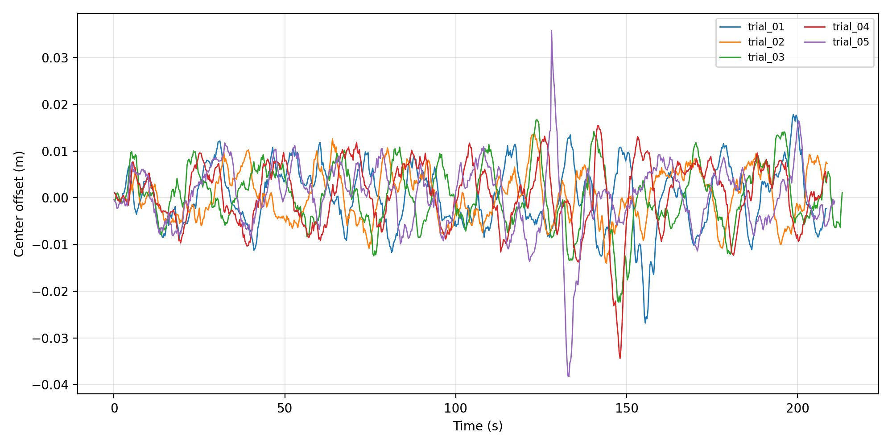
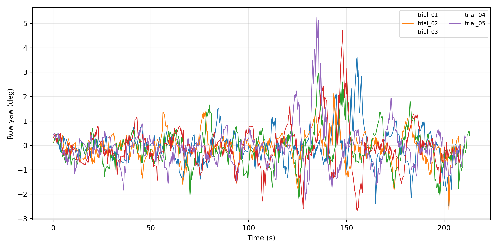
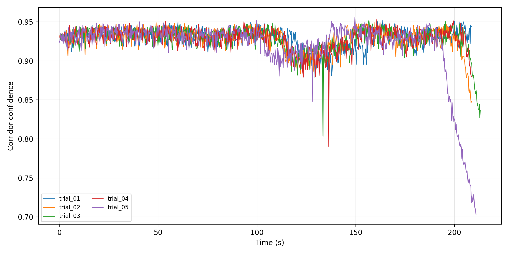
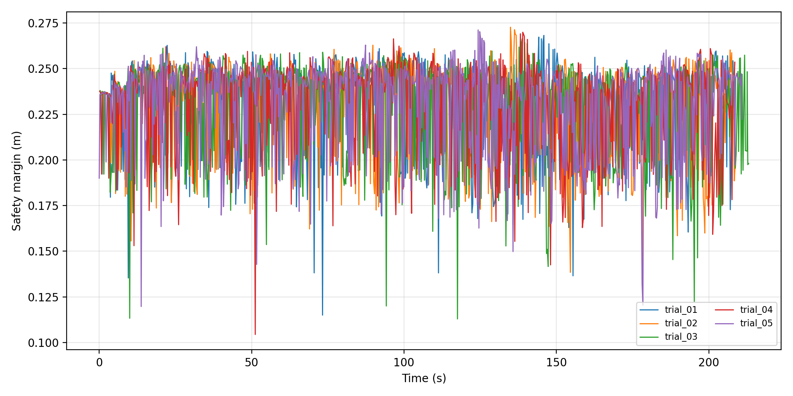
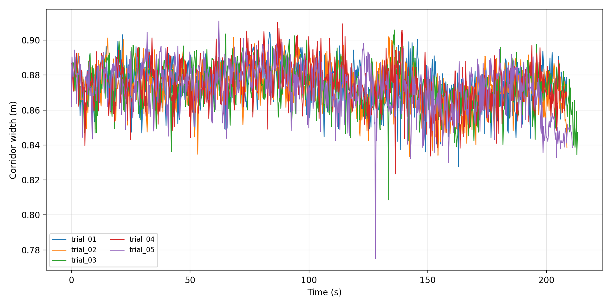
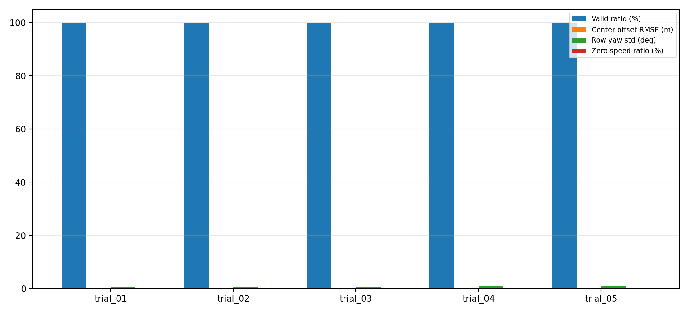

# zhenshi4hang16m 五次中心线检测诊断汇总

- 数据目录：`/home/xkai/agribot_test_logs/zhenshi4hang16m_quality_pid_diag`
- 数据来源：`/centerline_detection_diagnostics`、`/cmd_vel`、`/odom`
- 实验组：质量感知 PID + 中心线检测诊断

## 单次实验结果

| Trial | 时长/s | 诊断帧 | 有效率/% | 中心偏移RMSE/m | 中心偏移Std/m | 行向角Std/deg | 平均置信度 | 平均安全裕度/m | 零速比例/% | 行驶距离/m |
|---|---:|---:|---:|---:|---:|---:|---:|---:|---:|---:|
| trial_01 | 208.6 | 755 | 100.00 | 0.0068 | 0.0068 | 0.707 | 0.929 | 0.229 | 0.05 | 14.567 |
| trial_02 | 208.7 | 777 | 100.00 | 0.0054 | 0.0054 | 0.554 | 0.928 | 0.229 | 0.00 | 15.098 |
| trial_03 | 213.1 | 786 | 100.00 | 0.0065 | 0.0065 | 0.743 | 0.927 | 0.228 | 0.00 | 15.228 |
| trial_04 | 208.6 | 788 | 100.00 | 0.0071 | 0.0071 | 0.861 | 0.929 | 0.230 | 0.04 | 14.986 |
| trial_05 | 210.9 | 813 | 100.00 | 0.0073 | 0.0073 | 0.850 | 0.919 | 0.230 | 0.13 | 15.904 |

## 组内统计

| 指标 | 均值 | 标准差 | 最小值 | 最大值 |
|---|---:|---:|---:|---:|
| 中心线有效率/% | 100.0000 | 0.0000 | 100.0000 | 100.0000 |
| 中心偏移RMSE/m | 0.0066 | 0.0008 | 0.0054 | 0.0073 |
| 中心偏移标准差/m | 0.0066 | 0.0008 | 0.0054 | 0.0073 |
| 中心偏移P95绝对值/m | 0.0116 | 0.0012 | 0.0097 | 0.0128 |
| 行向角标准差/deg | 0.7430 | 0.1251 | 0.5536 | 0.8614 |
| 平均置信度 | 0.9266 | 0.0041 | 0.9194 | 0.9293 |
| 低置信比例/% | 0.0000 | 0.0000 | 0.0000 | 0.0000 |
| 平均安全裕度/m | 0.2292 | 0.0008 | 0.2284 | 0.2302 |
| 低安全裕度比例/% | 0.0000 | 0.0000 | 0.0000 | 0.0000 |
| 平均走廊宽度/m | 0.8736 | 0.0009 | 0.8720 | 0.8744 |
| 历史模型保持比例/% | 0.0508 | 0.0696 | 0.0000 | 0.1272 |
| 零速比例/% | 0.0431 | 0.0517 | 0.0000 | 0.1267 |
| 行驶距离/m | 15.1568 | 0.4859 | 14.5673 | 15.9045 |

## 曲线图

### 中心偏移曲线

### 行向角曲线

### 走廊置信度曲线

### 安全裕度曲线

### 走廊宽度曲线

### 关键指标柱状图

## 结果说明

- 五次实验中心线有效率均值为 `100.00%`，说明在该场景下中心线输出连续性较好。
- 中心偏移 RMSE 均值为 `0.0066 m`，可作为中心线横向稳定性的量化指标。
- 行向角标准差均值为 `0.743 deg`，说明行方向估计存在一定短时波动，但整体处于较小角度范围。
- 平均置信度为 `0.927`，平均安全裕度为 `0.229 m`，表明检测得到的通行走廊质量较高。
- 零速比例均值为 `0.04%`，该指标反映控制器因低质量感知、路径缺失或速度调节导致的停顿程度。

## 可写入论文的表述

在 `zhenshi4hang16m.world` 场景下进行五次重复实验，所提出的中心线检测诊断结果显示，中心线有效率均值为 100.00%，中心偏移 RMSE 均值为 0.0066 m，行方向角标准差均值为 0.743 deg，平均走廊置信度为 0.927，平均安全裕度为 0.229 m。结果表明，该方法在多行玉米仿真场景中能够保持较高的中心线输出连续性和较稳定的行间走廊估计。
