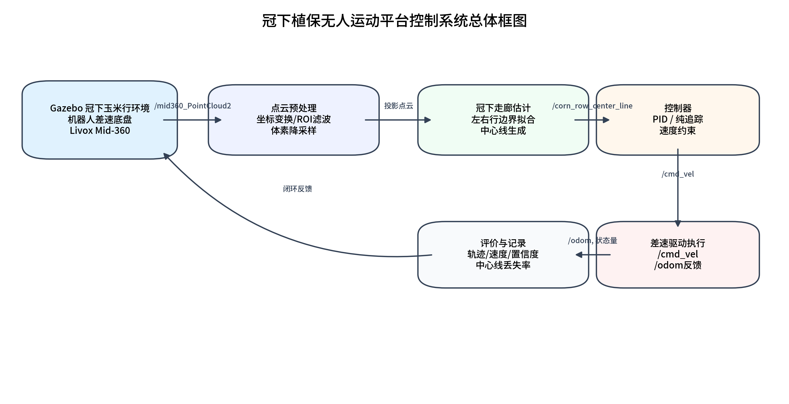
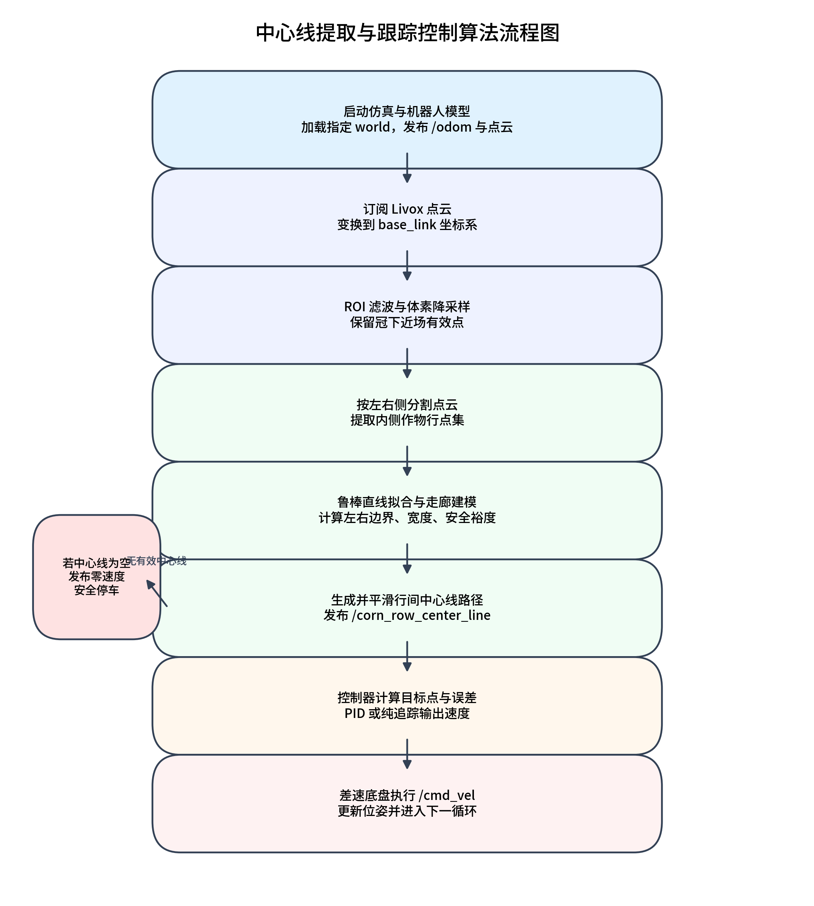
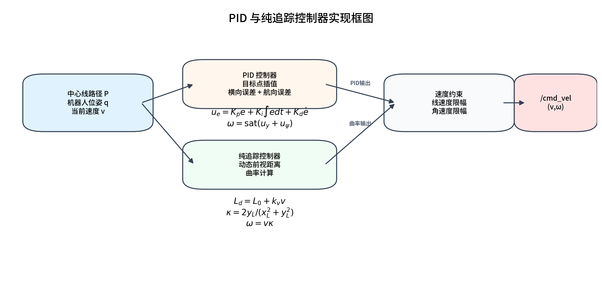
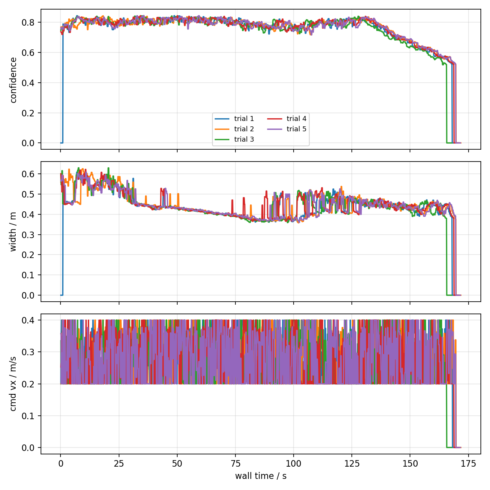
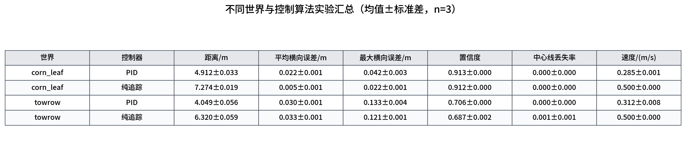
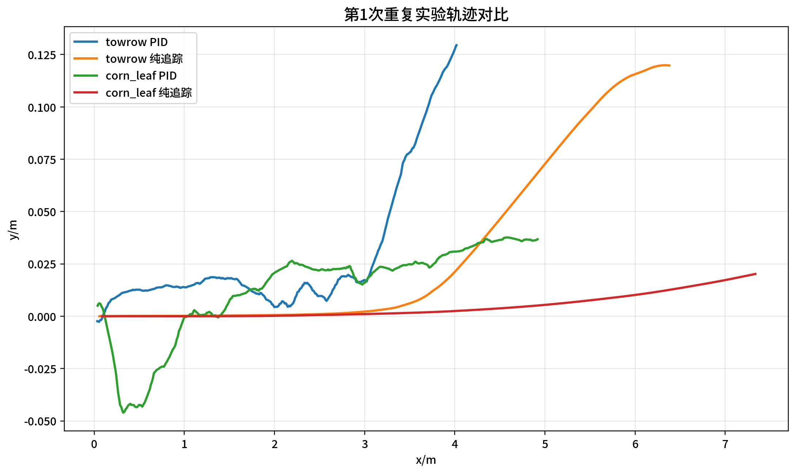

# 控制系统算法研究及仿真实验

## 1 章节概述

本文面向冠下植保无人运动平台在玉米行间的自主行驶需求，构建了基于三维激光雷达点云的冠下可通行走廊估计与运动控制系统。系统以 Gazebo 仿真环境中的差速移动平台为研究对象，通过 Livox Mid-360 激光雷达获取冠下点云，提取作物行内侧边界并生成行间中心线，再分别采用 PID 控制算法和纯追踪控制算法生成速度指令，实现机器人沿行间通道稳定行驶。

本章重点研究控制系统算法实现及仿真实验验证。算法层面包括点云预处理、作物行左右边界拟合、行间中心线生成、PID 跟踪控制和纯追踪控制。实验层面包括两部分：第一部分在 `twoworld.world` 环境下进行 5 次 PID 闭环重复实验，用于验证系统基础可重复性；第二部分在 `towrow.world` 和 `corn_leaf_world.world` 两种环境中对比 PID 与纯追踪控制算法，用于分析不同控制策略在不同冠下场景中的运动性能差异。

## 2 系统总体结构

冠下植保无人运动平台控制系统由仿真环境、感知模块、路径生成模块、控制模块和实验记录模块组成。系统输入为激光雷达点云和机器人里程计信息，输出为差速底盘速度控制指令。其总体结构如图 1 所示。



**图 1  冠下植保无人运动平台控制系统总体框图**

系统中各模块功能如下：

- 仿真环境：通过 `ros2 launch diff_drive_robot robot.launch.py world:=... gui:=true` 启动差速机器人、Gazebo 世界和 Livox 点云仿真插件。
- 感知模块：订阅 `/mid360_PointCloud2`，完成点云坐标变换、ROI 滤波、体素降采样和左右作物行提取。
- 路径生成模块：拟合左右内侧作物行边界，生成行间中心线 `/corn_row_center_line`，同时输出走廊宽度、置信度和安全裕度。
- 控制模块：订阅中心线和 `/odom`，采用 PID 或纯追踪算法计算 `/cmd_vel`。
- 实验记录模块：记录轨迹、速度、中心线状态、置信度、走廊宽度和终止原因，并生成 CSV、轨迹图和对比表。

算法运行流程如图 2 所示。



**图 2  中心线提取与跟踪控制算法流程图**

## 3 冠下中心线提取算法

### 3.1 点云预处理

设激光雷达在时刻 \(t\) 采集到的原始点云为

\[
\mathcal{P}_t=\{p_i=(x_i,y_i,z_i)\mid i=1,2,\cdots,N\}.
\]

首先将点云从传感器坐标系变换到机器人基坐标系 `base_link`，记变换矩阵为 \(T_b^l\)，则点 \(p_i\) 在机器人坐标系下表示为

\[
p_i^b=T_b^l p_i^l.
\]

随后进行冠下近场 ROI 滤波。设前向、横向和高度方向的有效范围分别为 \([x_{\min},x_{\max}]\)、\([y_{\min},y_{\max}]\)、\([z_{\min},z_{\max}]\)，则保留点集为

\[
\mathcal{P}_{roi}=\{p_i^b\in\mathcal{P}_t \mid
x_{\min}\le x_i\le x_{\max},\ 
y_{\min}\le y_i\le y_{\max},\ 
z_{\min}\le z_i\le z_{\max}\}.
\]

为降低点云密度波动对实时性的影响，对 ROI 点云进行体素降采样。设体素边长为 \(s\)，每个体素内的点由其质心近似表示：

\[
\bar{p}_v=\frac{1}{|\mathcal{V}|}\sum_{p_i\in \mathcal{V}}p_i.
\]

### 3.2 左右作物行分割与边界拟合

在机器人坐标系中，前进方向为 \(x\) 轴，横向方向为 \(y\) 轴。将点云按横向位置分为左、右两侧：

\[
\mathcal{P}_L=\{p_i\in\mathcal{P}_{roi}\mid y_i>0\},
\qquad
\mathcal{P}_R=\{p_i\in\mathcal{P}_{roi}\mid y_i<0\}.
\]

对于多行或宽行距场景，进一步从左右两侧点云中提取靠近机器人通道的内侧作物行点。然后分别对左右内侧点集进行直线拟合，得到左右边界模型：

\[
y_L=k_Lx+b_L,\qquad y_R=k_Rx+b_R.
\]

直线参数可通过最小二乘形式估计：

\[
(k,b)=\arg\min_{k,b}\sum_{i=1}^{n}(y_i-kx_i-b)^2.
\]

为提高连续帧稳定性，系统对拟合得到的边界参数进行低通滤波：

\[
\theta_t=\alpha\theta_t^{raw}+(1-\alpha)\theta_{t-1},
\]

其中 \(\theta\) 表示边界斜率或截距，\(\alpha\) 为滤波系数。

### 3.3 行间中心线与走廊指标

根据左右边界生成行间中心线。对于路径采样点 \(x_j\)，其中心线横向坐标为

\[
y_c(x_j)=\frac{y_L(x_j)+y_R(x_j)}{2}
=\frac{(k_L+k_R)x_j+(b_L+b_R)}{2}.
\]

中心线路径表示为

\[
\mathcal{C}=\{c_j=(x_j,y_c(x_j))\mid x_j=j\Delta x,\ j=0,1,\cdots,M\}.
\]

走廊宽度定义为左右边界横向距离：

\[
W(x_j)=|y_L(x_j)-y_R(x_j)|.
\]

考虑机器人平台宽度 \(W_p\)，安全裕度定义为

\[
M_s(x_j)=\frac{W(x_j)-W_p}{2}.
\]

当左右有效点数量不足、机器人前方无作物点或拟合结果不稳定时，感知模块发布空中心线，并将置信度置为 0。控制模块接收到空中心线后发布零速度指令，从而避免机器人在无可靠感知信息时继续前进。

## 4 运动控制算法

控制器订阅中心线路径 \(\mathcal{C}\) 和机器人里程计位姿

\[
q=(x,y,\psi),
\]

其中 \(x,y\) 为机器人在 `odom` 坐标系下的位置，\(\psi\) 为航向角。控制器输出差速底盘速度指令

\[
u=(v,\omega),
\]

其中 \(v\) 为线速度，\(\omega\) 为角速度。PID 与纯追踪控制器实现框图如图 3 所示。



**图 3  PID 与纯追踪控制器实现框图**

### 4.1 PID 中心线跟踪控制

PID 控制器首先在中心线路径中寻找距离机器人最近的路径点，再沿路径向前搜索目标距离 \(d_t\) 对应的目标点 \(p_t=(x_t,y_t)\)。将目标点变换到机器人车体坐标系：

\[
\begin{bmatrix}
x_v\\y_v
\end{bmatrix}
=
\begin{bmatrix}
\cos\psi & \sin\psi\\
-\sin\psi & \cos\psi
\end{bmatrix}
\begin{bmatrix}
x_t-x\\y_t-y
\end{bmatrix}.
\]

横向误差和航向误差分别定义为

\[
e_y=y_v,
\qquad
e_\psi=\arctan2(y_v,x_v).
\]

对横向误差和航向误差分别构造 PID 控制量：

\[
u_y=K_{py}e_y+K_{iy}\int e_y dt+K_{dy}\frac{de_y}{dt},
\]

\[
u_\psi=K_{p\psi}e_\psi+K_{i\psi}\int e_\psi dt+K_{d\psi}\frac{de_\psi}{dt}.
\]

最终角速度为两部分控制量之和并进行限幅：

\[
\omega=\mathrm{sat}_{[-\omega_{\max},\omega_{\max}]}(u_y+u_\psi).
\]

线速度根据转向强度自适应衰减：

\[
v=\max\left(v_{\min},
v_{\max}\left(1-\lambda\frac{|\omega|}{\omega_{\max}}\right)\right).
\]

当角速度较小时，机器人保持较高线速度；当转向幅度增大时，线速度降低，以减少行间跟踪过程中的横向偏移。

### 4.2 纯追踪控制

纯追踪控制器根据当前速度计算动态前视距离：

\[
L_d=L_0+k_v v.
\]

在中心线路径中搜索距离机器人不小于 \(L_d\) 的前视目标点 \(p_L=(x_L,y_L)\)，并将其转换到车体坐标系。纯追踪曲率为

\[
\kappa=\frac{2y_L}{x_L^2+y_L^2}.
\]

为减小稳态横向误差，在曲率中叠加最近路径点对应的横向偏差修正项：

\[
\kappa'=\kappa+k_e e_y.
\]

角速度由曲率和线速度计算：

\[
\omega=v\kappa'.
\]

线速度根据弯道程度进行衰减：

\[
v=\max\left(v_{\min},
v_{\max}\left(1-k_c\frac{|\omega|}{\omega_{\max}}\right)\right).
\]

纯追踪控制器具有结构简单、参数较少和前进效率高的特点，适合在中心线连续且局部曲率较小的行间环境中使用。

## 5 仿真实验设计

### 5.1 实验环境

实验平台采用 ROS2 Humble 与 Gazebo Classic。机器人模型为 `diff_drive_robot`，控制接口为 `/cmd_vel`，里程计话题为 `/odom`，感知输入为 `/mid360_PointCloud2`。

在调试过程中发现，Livox 点云仿真插件在 `gui:=false` 时只注册 `/mid360_PointCloud2` 发布者但不产生实际点云频率；开启 `gui:=true` 后点云频率恢复到约 3 Hz。因此，本文后续有效实验均采用 `gui:=true`，以保证感知输入有效。

同时，控制节点生命周期问题也进行了修复：原程序中 PID 或纯追踪控制器对象创建于局部作用域内，作用域结束后控制器节点析构，导致 `/cmd_vel` 无发布者。修复后控制器节点由外部 `shared_ptr` 保持生命周期，系统能够稳定发布速度指令。

### 5.2 评价指标

设第 \(i\) 个采样时刻机器人位置为 \(p_i=(x_i,y_i)\)，单次实验共记录 \(N\) 帧。行驶距离定义为

\[
D=\sum_{i=2}^{N}\sqrt{(x_i-x_{i-1})^2+(y_i-y_{i-1})^2}.
\]

由于仿真作物行整体沿 \(x\) 方向布置，横向误差定义为

\[
e_y(i)=|y_i|.
\]

平均横向误差和最大横向误差为

\[
\bar{e}_y=\frac{1}{N}\sum_{i=1}^{N}|y_i|,
\qquad
e_{y,\max}=\max_i |y_i|.
\]

中心线丢失率定义为中心线路径为空的采样帧比例：

\[
R_{loss}=\frac{N_{empty}}{N}.
\]

其中 \(N_{empty}\) 为 `/corn_row_center_line` 中 `poses` 为空的帧数。

## 6 基础闭环重复实验

第一组实验在 `twoworld.world` 中采用 PID 控制器进行 5 次重复闭环导航，用于验证系统基础可重复性。每次实验开始前调用 `/reset_world` 重置机器人位置，机器人沿中心线前进，直到行末附近中心线丢失或控制器停车。

### 6.1 定量结果

5 次实验均完成闭环行驶。统计结果如表 1 所示。

**表 1  `twoworld.world + PID` 五次重复实验统计结果**

| 指标 | 均值 | 标准差 |
|---|---:|---:|
| 行驶距离/m | 6.4818 | 0.0110 |
| 最终 \(x\)/m | 6.4498 | 0.0021 |
| 最终 \(y\)/m | 0.1120 | 0.0008 |
| 平均横向误差/m | 0.0634 | 0.0015 |
| 最大横向误差/m | 0.1132 | 0.0027 |
| 平均置信度 | 0.7699 | 0.0010 |
| 平均走廊宽度/m | 0.4466 | 0.0016 |
| 平均安全裕度/m | 0.0255 | 0.0004 |
| 中心线丢失率 | 0.0137 | 0.0017 |
| 平均速度指令/(m/s) | 0.2804 | 0.0010 |

机器人平均行驶距离为 \(6.4818~\mathrm{m}\)，标准差为 \(0.0110~\mathrm{m}\)，最终 \(x\) 坐标标准差仅为 \(0.0021~\mathrm{m}\)，说明系统在同一环境下具有较好的重复性。平均横向误差为 \(0.0634~\mathrm{m}\)，最大横向误差平均值为 \(0.1132~\mathrm{m}\)，能够满足仿真行间跟踪的基本要求。

### 6.2 轨迹与时序分析

图 4 给出了 5 次重复实验的机器人轨迹。各次轨迹基本重合，且停车位置接近，说明中心线提取和 PID 控制闭环较稳定。


**图 4  `twoworld.world + PID` 五次重复实验轨迹**

图 5 给出了走廊置信度、走廊宽度和速度指令的时序变化。机器人在大部分行驶阶段保持稳定置信度和稳定速度；接近行末时，前方有效作物点减少，中心线输出为空，控制器发布零速度并停车。



**图 5  `twoworld.world + PID` 走廊估计与速度指令时序曲线**

图 6 为单次重复实验结果表格化可视化。


**图 6  `twoworld.world + PID` 五次重复实验结果表**

## 7 不同世界与控制算法对比实验

第二组实验比较 `towrow.world` 和 `corn_leaf_world.world` 两个 Gazebo 世界中 PID 与纯追踪控制器的表现。每种组合重复 3 次，单次最大实验时间为 60 s。实验组合为：

- `towrow.world + PID`
- `towrow.world + 纯追踪`
- `corn_leaf_world.world + PID`
- `corn_leaf_world.world + 纯追踪`

### 7.1 定量结果

实验统计结果如表 2 所示。

**表 2  不同世界与控制算法对比实验结果**

| 世界 | 控制器 | 行驶距离/m | 平均横向误差/m | 最大横向误差/m | 平均置信度 | 平均走廊宽度/m | 中心线丢失率 | 平均速度/(m/s) |
|---|---|---:|---:|---:|---:|---:|---:|---:|
| `towrow.world` | PID | 4.049±0.056 | 0.030±0.001 | 0.133±0.004 | 0.706±0.000 | 0.834±0.000 | 0.000±0.000 | 0.312±0.008 |
| `towrow.world` | 纯追踪 | 6.320±0.059 | 0.033±0.001 | 0.121±0.001 | 0.687±0.002 | 0.790±0.001 | 0.001±0.001 | 0.500±0.000 |
| `corn_leaf_world.world` | PID | 4.912±0.033 | 0.022±0.001 | 0.042±0.003 | 0.913±0.000 | 1.359±0.000 | 0.000±0.000 | 0.285±0.001 |
| `corn_leaf_world.world` | 纯追踪 | 7.274±0.019 | 0.005±0.001 | 0.022±0.001 | 0.912±0.000 | 1.354±0.001 | 0.000±0.000 | 0.500±0.000 |



**图 7  不同世界与控制算法实验汇总表**

图 8 为关键指标柱状图。可以看出，在两个世界中纯追踪控制器的行驶距离均明显高于 PID 控制器。其原因是纯追踪控制器在实验中基本保持 \(0.5~\mathrm{m/s}\) 的速度，而 PID 控制器会根据角速度进行减速，平均速度约为 \(0.285\sim0.312~\mathrm{m/s}\)。


**图 8  不同世界与控制算法关键指标对比**

图 9 为各组合第 1 次重复实验的轨迹对比。



**图 9  不同世界与控制算法第 1 次重复实验轨迹对比**

### 7.2 结果分析

在 `towrow.world` 中，纯追踪控制器的平均行驶距离为 \(6.320~\mathrm{m}\)，高于 PID 控制器的 \(4.049~\mathrm{m}\)。二者平均横向误差分别为 \(0.033~\mathrm{m}\) 和 \(0.030~\mathrm{m}\)，差异较小。该世界中中心线置信度约为 \(0.687\sim0.706\)，低于 `corn_leaf_world.world`，说明该环境下点云行结构更稀疏或局部波动更明显。

在 `corn_leaf_world.world` 中，纯追踪控制器的平均行驶距离为 \(7.274~\mathrm{m}\)，高于 PID 控制器的 \(4.912~\mathrm{m}\)。同时，纯追踪控制器平均横向误差仅为 \(0.005~\mathrm{m}\)，低于 PID 控制器的 \(0.022~\mathrm{m}\)。该世界中心线平均置信度约为 \(0.912\sim0.913\)，中心线丢失率为 0，说明该环境中感知输出较稳定。

综合两组实验可知：PID 控制器速度较保守，但运动稳定；纯追踪控制器前进效率更高，在中心线连续且置信度较高的环境中具有更好的行驶距离和横向跟踪表现。

## 8 本章小结与进一步优化方向

本章完成了冠下植保无人运动平台控制系统的算法实现与仿真实验验证。通过点云预处理、左右作物行边界拟合和中心线生成，系统能够为控制器提供稳定的行间参考路径。PID 控制器和纯追踪控制器均能够实现闭环行驶，其中纯追踪控制器在对比实验中表现出更高的行驶效率，尤其在 `corn_leaf_world.world` 中取得了更小的横向误差。

当前系统仍存在以下可进一步优化的方向：

- 感知鲁棒性优化：当前中心线主要依赖局部点云，当行末或植株稀疏区域出现点云不足时，中心线会变为空。后续可加入历史中心线保持、短时轨迹预测或局部地图记忆机制。
- 控制参数自适应：PID 和纯追踪参数目前主要固定设置。后续可根据走廊宽度、中心线置信度和曲率动态调整速度、前视距离和控制增益。
- 障碍物检测优化：当前障碍检测容易将作物行点云误判为障碍。后续可引入作物行点与真实障碍物的空间语义区分，提高安全决策可靠性。
- 仿真环境扩展：当前实验主要覆盖直线或局部规则行间环境。后续应增加弯曲行、缺株、杂草、枝叶遮挡、不同光照和不同地面起伏条件。
- 实物平台验证：仿真结果需要进一步在真实冠下植保无人平台上验证，重点评估传感器噪声、轮式底盘打滑、通信延迟和作物叶片遮挡对系统性能的影响。
- 控制器融合：可设计基于置信度的控制器切换策略，在中心线稳定时使用纯追踪提高效率，在窄行距或中心线波动时使用更保守的 PID 控制提高安全性。

总体而言，本章实验表明，基于冠下点云中心线提取的运动控制系统能够在仿真玉米行环境中实现稳定闭环导航，为后续开展真实冠下植保无人运动平台控制系统研究提供了算法基础和实验依据。

## 9 数据与图片文件

本章相关数据和图片均保存在以下目录：

```text
experiments/control_system_algorithm_chapter_20260608/
```

主要文件包括：

- `control_system_algorithm_chapter.md`：本章节正文。
- `system_block_diagram.png`：系统总体框图。
- `algorithm_flowchart.png`：算法流程图。
- `controller_block_diagram.png`：PID 与纯追踪控制器框图。
- `exp1_summary.csv`：第一组基础闭环重复实验数据。
- `exp2_aggregate_summary.csv`：第二组世界与控制算法对比实验聚合数据。
- `exp1_trajectory.png`、`exp1_metrics_timeseries.png`、`exp1_summary_table.png`：第一组实验图表。
- `exp2_comparison_table.png`、`exp2_comparison_bars.png`、`exp2_combined_trajectories.png`：第二组实验图表。
