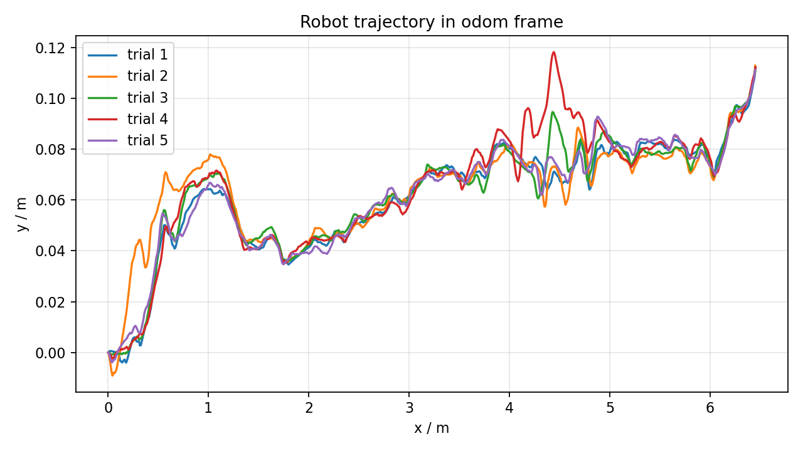
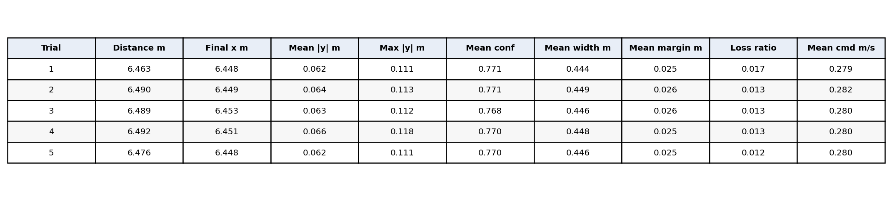

# 仿真实验与结果分析

## 实验设置

为验证本文提出的基于激光雷达的冠下行间可通行走廊估计与跟踪控制方法，在 Gazebo 仿真环境中开展了闭环导航实验。实验场景采用 `twoworld.world` 玉米行仿真环境，机器人模型采用 `diff_drive_robot`，传感器为仿真的 Livox Mid-360 激光雷达，点云数据通过 `/mid360_PointCloud2` 话题发布。

实验系统由感知模块和控制模块两部分组成。感知模块 `corn_row_detector_projection` 根据激光点云估计冠下可通行走廊，并输出行间中心线、左右边界、走廊宽度、走廊安全裕度和感知置信度等信息。控制模块 `cornfield_navigation_node` 订阅中心线路径，并通过 PID 控制器向 `/cmd_vel` 发布速度指令，实现机器人沿行间走廊自主行驶。

实验共重复 5 次。每次实验开始前，通过 `/reset_world` 服务重置 Gazebo 世界，使机器人回到相同初始位置。机器人沿检测到的行间中心线向前行驶，直到感知模块无法在机器人前方检测到有效作物行。此时中心线输出为空，走廊置信度降为 0，控制器自动发布零速度指令并停车。所有实验均采用相同的终止条件，以保证结果具有可重复性和可比性。

实验过程中记录的话题包括 `/odom`、`/cmd_vel`、`/corn_row_center_line`、`/corridor_confidence`、`/corridor_width`、`/corridor_safety_margin` 和 `/obstacle_detected`。记录内容包括机器人轨迹、速度指令、中心线状态、走廊宽度、安全裕度和置信度等数据。

## 评价指标

设第 \(i\) 个采样时刻机器人在里程计坐标系下的位置为

\[
p_i=(x_i,y_i),
\]

单次实验共记录 \(N\) 帧数据。机器人行驶距离 \(D\) 定义为相邻里程计位置之间欧氏距离的累加：

\[
D=\sum_{i=2}^{N}\sqrt{(x_i-x_{i-1})^2+(y_i-y_{i-1})^2}.
\]

由于仿真场景中的作物行整体近似沿 \(x\) 轴方向布置，机器人横向跟踪误差可用里程计坐标中的横向偏移绝对值表示：

\[
e_y(i)=|y_i|.
\]

平均横向误差和最大横向误差分别定义为：

\[
\bar{e}_y=\frac{1}{N}\sum_{i=1}^{N}|y_i|,
\qquad
e_{y,\max}=\max_i |y_i|.
\]

中心线丢失率 \(R_{\text{loss}}\) 定义为中心线路径为空的采样帧数占总采样帧数的比例：

\[
R_{\text{loss}}=\frac{N_{\text{empty}}}{N}.
\]

其中，\(N_{\text{empty}}\) 为 `/corn_row_center_line` 中 `poses` 为空的帧数。走廊置信度 \(C\)、走廊宽度 \(W\) 和安全裕度 \(M\) 由感知模块直接输出，用于评价可通行走廊估计的稳定性和安全性。

## 定量结果

5 次重复实验均成功完成闭环导航，并在行末附近自动停车。实验结果表明，机器人最终停车位置高度一致，平均行驶距离为 \(6.4818~\text{m}\)，标准差仅为 \(0.0110~\text{m}\)。机器人平均最终纵向位置为 \(x=6.4498~\text{m}\)，标准差为 \(0.0021~\text{m}\)，说明系统在相同场景下具有较好的重复性。

在跟踪精度方面，机器人平均横向误差为 \(0.0634~\text{m}\)，最大横向误差平均值为 \(0.1132~\text{m}\)。这说明机器人在行驶过程中能够较稳定地保持在估计的行间走廊中心附近。

在感知质量方面，走廊平均置信度为 \(0.7699\)，最小有效置信度平均值为 \(0.5214\)。这表明在大部分行驶过程中，感知模块能够维持较稳定的走廊估计。当机器人接近行末时，前方可观测作物行逐渐消失，中心线输出变为空，置信度降为 0，控制器随即停车。

走廊宽度平均值为 \(0.4466~\text{m}\)，最小宽度平均值为 \(0.3606~\text{m}\)。平均安全裕度为 \(0.0255~\text{m}\)，虽然安全裕度较小，但仍保持为正值，说明当前方法能够在较窄行间环境中估计出可供机器人通过的局部通道。

表 1 给出了 5 次实验的总体统计结果。

**表 1  五次仿真实验总体统计结果**

| 指标 | 均值 | 标准差 |
|---|---:|---:|
| 实验持续时间，真实时间 (s) | 170.4006 | 1.4278 |
| 行驶距离 (m) | 6.4818 | 0.0110 |
| 最终纵向位置 \(x\) (m) | 6.4498 | 0.0021 |
| 平均横向误差 \(\bar{e}_y\) (m) | 0.0634 | 0.0015 |
| 最大横向误差 \(e_{y,\max}\) (m) | 0.1132 | 0.0027 |
| 平均走廊置信度 | 0.7699 | 0.0010 |
| 最小走廊置信度 | 0.5214 | 0.0023 |
| 平均走廊宽度 (m) | 0.4466 | 0.0016 |
| 最小走廊宽度 (m) | 0.3606 | 0.0027 |
| 平均安全裕度 (m) | 0.0255 | 0.0004 |
| 中心线丢失率 | 0.0137 | 0.0017 |
| 障碍检测触发比例 | 0.8866 | 0.0028 |
| 平均速度指令 (m/s) | 0.2804 | 0.0010 |

表 2 给出了每次实验的详细结果。

**表 2  单次闭环导航实验结果**

| 实验编号 | 行驶距离 (m) | 最终 x (m) | 最终 y (m) | 平均 \(|y|\) (m) | 最大 \(|y|\) (m) | 平均置信度 | 平均宽度 (m) | 平均安全裕度 (m) | 终止原因 |
|---:|---:|---:|---:|---:|---:|---:|---:|---:|---|
| 1 | 6.4626 | 6.4482 | 0.1107 | 0.0616 | 0.1107 | 0.7707 | 0.4444 | 0.0252 | 中心线丢失或控制器停车 |
| 2 | 6.4899 | 6.4491 | 0.1130 | 0.0640 | 0.1130 | 0.7711 | 0.4488 | 0.0262 | 中心线丢失或控制器停车 |
| 3 | 6.4885 | 6.4532 | 0.1123 | 0.0635 | 0.1123 | 0.7683 | 0.4458 | 0.0255 | 中心线丢失或控制器停车 |
| 4 | 6.4916 | 6.4510 | 0.1123 | 0.0658 | 0.1183 | 0.7701 | 0.4483 | 0.0254 | 中心线丢失或控制器停车 |
| 5 | 6.4762 | 6.4475 | 0.1114 | 0.0622 | 0.1114 | 0.7696 | 0.4458 | 0.0252 | 中心线丢失或控制器停车 |

## 轨迹与时序分析

图 1 为 5 次重复实验的机器人轨迹。可以看到，各次实验轨迹基本重合，机器人均沿作物行方向稳定前进，并在相近位置停车。这说明感知与控制闭环在该仿真场景下具有较好的重复性。

**图 1  五次重复实验中的机器人里程计轨迹**

图 2 为走廊置信度、走廊宽度和速度指令的时序曲线。从图中可以看出，在行驶的大部分阶段，走廊置信度和宽度保持相对稳定；当机器人接近行末时，前方有效作物点减少，中心线输出为空，置信度降为 0，控制器发布零速度指令并停车。

**图 2  走廊置信度、走廊宽度和速度指令时序曲线**

图 3 给出了单次实验结果的表格化可视化，便于论文排版或实验汇报中直接引用。

**图 3  五次闭环导航实验结果表**

## 结果讨论

实验结果表明，本文方法能够在仿真玉米行环境中实现稳定的冠下行间走廊估计与闭环跟踪控制。5 次重复实验的行驶距离和最终停车位置高度一致，说明系统具有较好的重复性。机器人平均横向误差约为 \(0.063~\text{m}\)，最大横向误差小于 \(0.12~\text{m}\)，能够满足当前仿真平台在行间导航任务中的基本跟踪需求。

从感知结果来看，走廊置信度在大部分行驶过程中保持在较高水平，说明分段式走廊估计方法能够在点云局部缺失和作物点分布不均的情况下维持稳定输出。当机器人到达行末区域后，感知模块检测到前方无有效作物行，主动输出空中心线，并使置信度降为 0。该机制避免了机器人在无可靠感知信息时继续盲目前进，具有一定安全意义。

不过，实验也暴露出当前方法的两个不足。第一，系统主要依赖局部点云感知，当机器人前方作物行消失时，缺少基于历史轨迹或全局先验的短时预测能力，因此只能停车。第二，当前障碍检测模块频繁将作物行点云识别为障碍，导致障碍检测触发比例较高。虽然该现象未直接导致本实验中的停车行为，但会影响系统对真实障碍物的判别能力。

总体而言，本实验验证了所提出的冠下可通行走廊估计接口能够为农业机器人提供稳定的中心线、走廊宽度、置信度和安全裕度信息，并支持机器人完成闭环行间导航任务。后续工作可进一步引入行末预测、历史中心线保持和作物边界点与真实障碍物的语义区分机制，从而提升系统在复杂冠下环境中的连续导航能力和安全决策能力。

