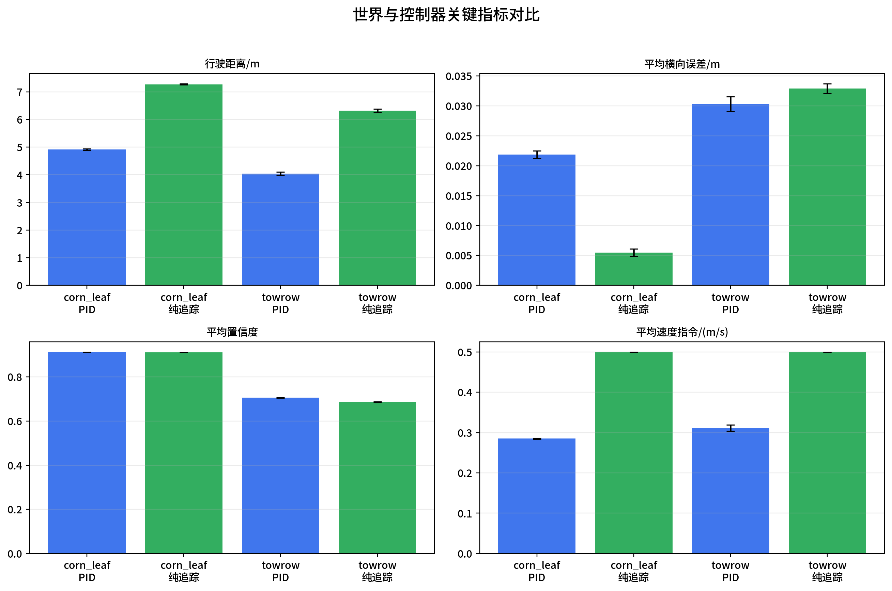

# 不同世界与控制算法对比实验

本实验对比 Gazebo 世界和两种控制算法。由于 Livox 点云插件在 `gui:=false` 下不发布 `/mid360_PointCloud2` 实测数据，本轮采用 `gui:=true` 运行，以保证传感器数据有效。

## 跑不起来的原因与修复

前一轮实验失败不是世界本身完全不可用，而是两个问题叠加造成的：

1. Gazebo 以 `gui:=false` 启动时，`/mid360_PointCloud2` 只有发布者注册但无实际消息频率；开启 `gui:=true` 后点云频率恢复到约 3 Hz，中心线检测恢复输出。
2. `centerline_extraction/src/main.cpp` 中 PID/纯追踪控制器对象创建在 `if/else` 局部作用域内，代码块结束后控制器节点被析构，导致 `/cmd_vel` 没有发布者。修复后 `/pid_controller` 或 `/pure_pursuit_controller` 能保留在节点列表中，并稳定发布速度指令。

对比组合如下：

- 世界：`towrow.world`、`corn_leaf_world.world`
- 控制算法：PID、纯追踪
- 每组重复次数：3 次
- Gazebo UI：`true`

## 汇总结果

| 世界 | 控制器 | 行驶距离 m | 最终 x m | 平均横向误差 m | 最大横向误差 m | 平均置信度 | 平均宽度 m | 中心线丢失率 | 平均速度 m/s |
|---|---|---:|---:|---:|---:|---:|---:|---:|---:|
| corn_leaf_world.world | pid | 4.912±0.033 | 4.950±0.035 | 0.022±0.001 | 0.042±0.003 | 0.913±0.000 | 1.359±0.000 | 0.000±0.000 | 0.285±0.001 |
| corn_leaf_world.world | pure_pursuit | 7.274±0.019 | 7.362±0.021 | 0.005±0.001 | 0.022±0.001 | 0.912±0.000 | 1.354±0.001 | 0.000±0.000 | 0.500±0.000 |
| towrow.world | pid | 4.049±0.056 | 4.069±0.055 | 0.030±0.001 | 0.133±0.004 | 0.706±0.000 | 0.834±0.000 | 0.000±0.000 | 0.312±0.008 |
| towrow.world | pure_pursuit | 6.320±0.059 | 6.381±0.062 | 0.033±0.001 | 0.121±0.001 | 0.687±0.002 | 0.790±0.001 | 0.001±0.001 | 0.500±0.000 |

## 结果分析

在 `towrow.world` 中，纯追踪控制器的平均行驶距离为 6.320 m，高于 PID 的 4.049 m；两者平均横向误差接近，分别为 0.033 m 和 0.030 m。该世界的中心线置信度约为 0.69 至 0.71，低于 `corn_leaf_world.world`，说明其点云行结构更稀疏或局部更不稳定。

在 `corn_leaf_world.world` 中，纯追踪控制器的平均行驶距离为 7.274 m，高于 PID 的 4.912 m；同时纯追踪的平均横向误差为 0.005 m，低于 PID 的 0.022 m。两种控制器的中心线丢失率均为 0，平均置信度约为 0.912 至 0.913，说明该世界的感知输入更稳定。

整体看，在当前 60 s 重复实验设置下，纯追踪控制器具有更高的前进效率；在 `corn_leaf_world.world` 中还表现出更小的横向误差。PID 控制器速度更保守，行驶距离较短，但中心线跟踪稳定，没有出现中心线丢失导致的早停。

## 输出文件

- 总汇总 CSV：`combined_summary.csv`
- 聚合汇总 CSV：`aggregate_summary.csv`
- 汇总表图片：`comparison_table.png`
- 指标柱状图：`comparison_bars.png`
- 轨迹对比图：`combined_trajectories.png`
- `corn_leaf_world.world` + `pid`：`corn_leaf_world.world_pid/`
- `corn_leaf_world.world` + `pure_pursuit`：`corn_leaf_world.world_pure_pursuit/`
- `towrow.world` + `pid`：`towrow.world_pid/`
- `towrow.world` + `pure_pursuit`：`towrow.world_pure_pursuit/`
